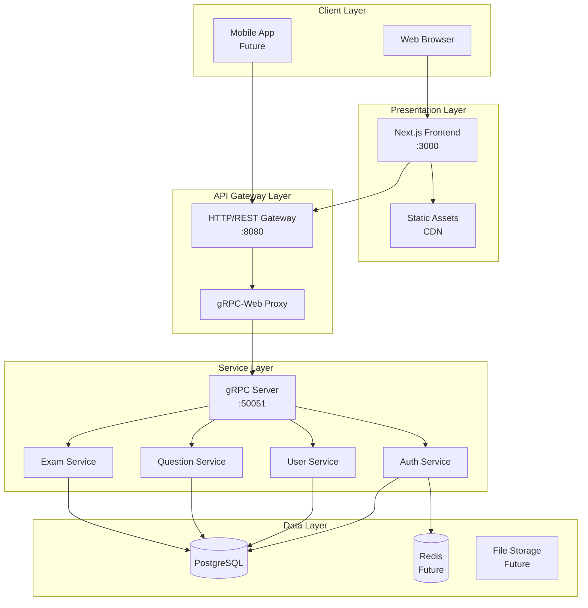

# 📐 Tài liệu Thiết kế Kiến trúc - NyNus Exam Bank System

## 📚 Mục lục
1. [Tổng quan](#tổng-quan)
2. [Kiến trúc tổng thể](#kiến-trúc-tổng-thể)  
3. [Backend Architecture](#backend-architecture)
4. [Frontend Architecture](#frontend-architecture)
5. [Database Design](#database-design)
6. [API Design](#api-design)
7. [Security Architecture](#security-architecture)
8. [Deployment Architecture](#deployment-architecture)
9. [Performance & Scalability](#performance--scalability)
10. [Monitoring & Logging](#monitoring--logging)

---

## 1. Tổng quan

### 1.1 Giới thiệu
NyNus Exam Bank System là một hệ thống quản lý ngân hàng câu hỏi và thi trực tuyến hiện đại, được xây dựng theo kiến trúc microservices với gRPC backend và Next.js frontend.

### 1.2 Mục tiêu kiến trúc
- **Scalability**: Khả năng mở rộng linh hoạt theo nhu cầu
- **Performance**: Hiệu suất cao với gRPC và Protocol Buffers
- **Security**: Bảo mật nhiều lớp với JWT và OAuth 2.0
- **Maintainability**: Dễ bảo trì với kiến trúc modular
- **Reliability**: Độ tin cậy cao với error handling và monitoring

### 1.3 Tech Stack
#### Backend
- **Language**: Go 1.21+
- **Framework**: gRPC với Protocol Buffers
- **Database**: PostgreSQL 15+
- **Authentication**: JWT + Google OAuth 2.0
- **ORM Pattern**: Custom Repository Pattern

#### Frontend  
- **Framework**: Next.js 15 với React 19
- **Language**: TypeScript
- **Styling**: Tailwind CSS v4
- **UI Components**: Radix UI + Shadcn/ui
- **State Management**: Zustand + React Query
- **Package Manager**: pnpm

#### Infrastructure
- **Containerization**: Docker & Docker Compose
- **Development**: PowerShell automation scripts
- **CI/CD**: GitHub Actions
- **Database Migration**: Custom migration system

---

## 2. Kiến trúc tổng thể

### 2.1 System Overview
```
┌─────────────────────────────────────────────────────────────────────┐
│                           Load Balancer                             │
└────────────────┬─────────────────────────────┬─────────────────────┘
                 │                             │
        ┌────────▼────────┐          ┌────────▼────────┐
        │  Next.js App     │          │  Static Assets  │
        │  (Port 3000)     │          │      (CDN)      │
        └────────┬────────┘          └─────────────────┘
                 │
        ┌────────▼────────┐
        │  HTTP Gateway    │
        │  (Port 8080)     │
        └────────┬────────┘
                 │
        ┌────────▼────────┐
        │  gRPC Server     │
        │  (Port 50051)    │
        └────────┬────────┘
                 │
    ┌────────────┴────────────┐
    │                         │
┌───▼────┐            ┌───────▼────────┐
│PostgreSQL│           │  Redis Cache   │
│Database │           │   (Future)     │
└─────────┘           └────────────────┘
```

### 2.2 Component Interaction


---

## 3. Backend Architecture

### 3.1 Layered Architecture
```
apps/backend/
├── cmd/
│   └── main.go                 # Entry point
├── internal/
│   ├── app/                    # Application setup & initialization
│   ├── config/                 # Configuration management
│   ├── container/              # Dependency Injection container
│   ├── database/               # Database utilities
│   ├── entity/                 # Domain entities
│   ├── grpc/                   # gRPC service handlers
│   ├── interfaces/             # Service interfaces
│   ├── middleware/             # Interceptors & middleware
│   ├── migration/              # Database migrations
│   ├── repository/             # Data access layer
│   ├── seeder/                 # Data seeders
│   ├── server/                 # HTTP/gRPC servers
│   ├── service/                # Business logic layer
│   │   ├── domain_service/     # Domain services
│   │   └── service_mgmt/       # Service management layer
│   └── util/                   # Utility functions
└── pkg/
    └── proto/                  # Generated protobuf files
```

### 3.2 Service Architecture Pattern
```
┌────────────────────────────────────────────────────────┐
│                    gRPC Handler Layer                  │
│               (grpc/*_service.go)                      │
└────────────────────────┬───────────────────────────────┘
                         │
┌────────────────────────▼───────────────────────────────┐
│              Service Management Layer                  │
│            (service/service_mgmt/*)                    │
│   - Business orchestration                             │
│   - Transaction management                             │
│   - Cross-service communication                        │
└────────────────────────┬───────────────────────────────┘
                         │
┌────────────────────────▼───────────────────────────────┐
│               Domain Service Layer                     │
│           (service/domain_service/*)                   │
│   - Core business logic                                │
│   - Domain rules enforcement                           │
│   - Entity validation                                  │
└────────────────────────┬───────────────────────────────┘
                         │
┌────────────────────────▼───────────────────────────────┐
│                 Repository Layer                       │
│              (repository/*)                            │
│   - Data access abstraction                            │
│   - Query building                                     │
│   - Database operations                                │
└────────────────────────┬───────────────────────────────┘
                         │
┌────────────────────────▼───────────────────────────────┐
│                   Database Layer                       │
│                   (PostgreSQL)                         │
└─────────────────────────────────────────────────────────┘
```

### 3.3 Dependency Injection Container
```go
Container Structure:
├── Database Connection
├── Repositories
│   ├── UserRepository
│   ├── QuestionRepository
│   ├── QuestionCodeRepository
│   ├── AnswerRepository
│   └── ExamRepository
├── Domain Services
│   ├── AuthService
│   ├── UserService
│   ├── QuestionService
│   └── ExamService
├── Service Management
│   ├── UserMgmt
│   ├── QuestionMgmt
│   └── ExamMgmt
├── gRPC Services
│   ├── UserServiceServer
│   ├── QuestionServiceServer
│   ├── QuestionFilterServiceServer
│   ├── ProfileServiceServer
│   └── AdminServiceServer
└── Interceptors
    ├── RateLimitInterceptor
    ├── AuthInterceptor
    ├── SessionInterceptor
    ├── RoleLevelInterceptor
    └── AuditLogInterceptor
```

### 3.4 Middleware Chain
```
Request Flow:
1. Rate Limiting     → Prevent abuse
2. Authentication    → Verify JWT token
3. Session Check     → Validate user session
4. Authorization     → Check role/permissions
5. Audit Logging     → Log actions
6. Business Logic    → Execute service
```

---

## 4. Frontend Architecture

### 4.1 Project Structure
```
apps/frontend/
├── src/
│   ├── app/                    # Next.js App Router
│   │   ├── (auth)/             # Auth routes
│   │   ├── (dashboard)/        # Dashboard routes
│   │   ├── api/                # API routes
│   │   └── layout.tsx          # Root layout
│   ├── components/             # React components
│   │   ├── ui/                 # Base UI components
│   │   ├── forms/              # Form components
│   │   ├── layouts/            # Layout components
│   │   └── features/           # Feature components
│   ├── contexts/               # React contexts
│   ├── hooks/                  # Custom React hooks
│   ├── lib/                    # Utility libraries
│   │   ├── api/                # API client
│   │   ├── grpc/               # gRPC-Web client
│   │   └── utils/              # Helper functions
│   ├── providers/              # Context providers
│   ├── services/               # Service layer
│   ├── store/                  # Zustand stores
│   └── types/                  # TypeScript types
├── public/                     # Static assets
└── scripts/                    # Build & dev scripts
```

### 4.2 State Management Architecture
```
┌──────────────────────────────────────────────────┐
│                React Components                   │
└────────────┬──────────────────────┬──────────────┘
             │                      │
    ┌────────▼────────┐    ┌───────▼────────┐
    │  Zustand Store  │    │  React Query   │
    │  (Client State) │    │  (Server State)│
    └────────┬────────┘    └───────┬────────┘
             │                      │
    ┌────────▼──────────────────────▼────────┐
    │           Service Layer                 │
    │    (API calls, data transformation)     │
    └────────────────┬────────────────────────┘
                     │
    ┌────────────────▼────────────────────────┐
    │           API Client Layer              │
    │    (Axios, gRPC-Web, Interceptors)      │
    └──────────────────────────────────────────┘
```

### 4.3 Component Design Pattern
```typescript
// Feature Component Structure
components/
├── features/
│   ├── questions/
│   │   ├── QuestionList/
│   │   │   ├── index.tsx
│   │   │   ├── QuestionList.tsx
│   │   │   ├── QuestionListItem.tsx
│   │   │   ├── QuestionListFilter.tsx
│   │   │   └── types.ts
│   │   └── QuestionEditor/
│   │       ├── index.tsx
│   │       ├── QuestionEditor.tsx
│   │       ├── QuestionPreview.tsx
│   │       └── hooks.ts
```

---

## 5. Database Design

### 5.1 Schema Overview
```sql
-- Core Tables
┌─────────────┐     ┌──────────────┐     ┌─────────────┐
│    users    │────<│   sessions   │     │    exams    │
└─────────────┘     └──────────────┘     └─────────────┘
       │                                         │
       │                                         │
       ▼                                         ▼
┌─────────────┐     ┌──────────────┐     ┌─────────────┐
│  questions  │────<│   answers    │────>│exam_attempts│
└─────────────┘     └──────────────┘     └─────────────┘
       │
       │
       ▼
┌─────────────┐     ┌──────────────┐
│question_codes│────<│question_tags │
└─────────────┘     └──────────────┘
```

### 5.2 Key Tables

#### Users Table
```sql
CREATE TABLE users (
    id TEXT PRIMARY KEY,
    email TEXT UNIQUE NOT NULL,
    password_hash TEXT,
    name TEXT NOT NULL,
    avatar TEXT,
    role TEXT NOT NULL,
    level TEXT,
    status TEXT DEFAULT 'active',
    provider TEXT DEFAULT 'email',
    email_verified BOOLEAN DEFAULT FALSE,
    created_at TIMESTAMPTZ DEFAULT NOW(),
    updated_at TIMESTAMPTZ DEFAULT NOW(),
    last_login TIMESTAMPTZ
);
```

#### Questions Table
```sql
CREATE TABLE questions (
    id TEXT PRIMARY KEY,
    raw_content TEXT NOT NULL,
    content TEXT NOT NULL,
    subcount TEXT,
    type TEXT NOT NULL,
    source TEXT,
    solution TEXT,
    status TEXT DEFAULT 'pending',
    difficulty TEXT,
    question_code_id TEXT REFERENCES question_codes(id),
    usage_count INTEGER DEFAULT 0,
    feedback_score INTEGER DEFAULT 0,
    created_by TEXT REFERENCES users(id),
    created_at TIMESTAMPTZ DEFAULT NOW(),
    updated_at TIMESTAMPTZ DEFAULT NOW()
);
```

### 5.3 Indexing Strategy
```sql
-- Performance indexes
CREATE INDEX idx_users_email ON users(email);
CREATE INDEX idx_users_role ON users(role);
CREATE INDEX idx_questions_code ON questions(question_code_id);
CREATE INDEX idx_questions_type ON questions(type);
CREATE INDEX idx_questions_difficulty ON questions(difficulty);
CREATE INDEX idx_questions_status ON questions(status);

-- Full-text search indexes
CREATE INDEX idx_questions_content_fts ON questions 
    USING gin(to_tsvector('vietnamese', content));
CREATE INDEX idx_questions_solution_fts ON questions 
    USING gin(to_tsvector('vietnamese', solution));
```

---

## 6. API Design

### 6.1 gRPC Services
```protobuf
// User Service
service UserService {
  rpc Login(LoginRequest) returns (LoginResponse);
  rpc GoogleLogin(GoogleLoginRequest) returns (LoginResponse);
  rpc RefreshToken(RefreshTokenRequest) returns (RefreshTokenResponse);
  rpc Register(RegisterRequest) returns (RegisterResponse);
  rpc GetUser(GetUserRequest) returns (GetUserResponse);
  rpc ListUsers(ListUsersRequest) returns (ListUsersResponse);
  rpc UpdateUser(UpdateUserRequest) returns (UpdateUserResponse);
}

// Question Service
service QuestionService {
  rpc CreateQuestion(CreateQuestionRequest) returns (CreateQuestionResponse);
  rpc GetQuestion(GetQuestionRequest) returns (GetQuestionResponse);
  rpc ListQuestions(ListQuestionsRequest) returns (ListQuestionsResponse);
  rpc ImportQuestions(ImportQuestionsRequest) returns (ImportQuestionsResponse);
}

// Question Filter Service
service QuestionFilterService {
  rpc ListQuestionsByFilter(FilterRequest) returns (FilterResponse);
  rpc SearchQuestions(SearchRequest) returns (SearchResponse);
  rpc GetQuestionsByQuestionCode(QuestionCodeRequest) returns (QuestionCodeResponse);
}
```

### 6.2 REST Gateway Mapping
```yaml
HTTP Gateway Endpoints:
  Authentication:
    POST   /api/v1/auth/login
    POST   /api/v1/auth/google-login
    POST   /api/v1/auth/refresh
    POST   /api/v1/auth/register
    POST   /api/v1/auth/logout
    
  Users:
    GET    /api/v1/users/:id
    GET    /api/v1/users
    PUT    /api/v1/users/:id
    GET    /api/v1/users/me
    
  Questions:
    POST   /api/v1/questions
    GET    /api/v1/questions/:id
    GET    /api/v1/questions
    POST   /api/v1/questions/import
    POST   /api/v1/questions/filter
    POST   /api/v1/questions/search
```

### 6.3 API Response Format
```json
// Success Response
{
  "success": true,
  "message": "Operation successful",
  "data": {
    // Response data
  },
  "pagination": {
    "page": 1,
    "limit": 10,
    "totalCount": 100,
    "totalPages": 10
  }
}

// Error Response
{
  "success": false,
  "message": "Error message",
  "error": {
    "code": "ERROR_CODE",
    "details": "Detailed error information"
  }
}
```

---

## 7. Security Architecture

### 7.1 Authentication Flow
```
┌──────────┐      ┌──────────┐      ┌──────────┐      ┌──────────┐
│  Client  │─────>│ Frontend │─────>│   API    │─────>│   Auth   │
│          │      │          │      │  Gateway │      │  Service │
└──────────┘      └──────────┘      └──────────┘      └──────────┘
     │                  │                 │                 │
     │   1. Login       │                 │                 │
     │─────────────────>│                 │                 │
     │                  │  2. Forward     │                 │
     │                  │─────────────────>│                 │
     │                  │                 │  3. Validate   │
     │                  │                 │─────────────────>│
     │                  │                 │                 │
     │                  │                 │  4. Generate   │
     │                  │                 │<────────────────│
     │                  │                 │    JWT Token   │
     │                  │  5. Return      │                 │
     │                  │<────────────────│                 │
     │  6. Set Cookie   │                 │                 │
     │<─────────────────│                 │                 │
```

### 7.2 Authorization Matrix
```
┌─────────────────┬──────────┬──────────┬─────────┬──────────┐
│    Resource     │  Admin   │ Teacher  │ Student │  Guest   │
├─────────────────┼──────────┼──────────┼─────────┼──────────┤
│ User Management │   Full   │   Read   │   Own   │   None   │
│ Questions       │   Full   │   Full   │   Read  │   None   │
│ Import CSV      │   Yes    │   Yes    │   No    │   No     │
│ Exams          │   Full   │   Full   │  Take   │   None   │
│ Statistics     │   Full   │  Limited │   Own   │   None   │
│ System Config  │   Full   │   None   │  None   │   None   │
└─────────────────┴──────────┴──────────┴─────────┴──────────┘
```

### 7.3 Security Measures
- **JWT Token**: Access token (15m) + Refresh token (7d)
- **OAuth 2.0**: Google OAuth integration
- **Rate Limiting**: Request throttling per IP/User
- **CORS**: Strict origin validation
- **HTTPS**: TLS encryption in production
- **Input Validation**: Schema validation with zod
- **SQL Injection Prevention**: Parameterized queries
- **XSS Prevention**: Content sanitization
- **CSRF Protection**: Token validation

---

## 8. Deployment Architecture

### 8.1 Docker Compose Stack
```yaml
services:
  postgres:
    image: postgres:15-alpine
    ports: ["5432:5432"]
    volumes:
      - postgres_data:/var/lib/postgresql/data
      - ./init.sql:/docker-entrypoint-initdb.d/init.sql
    
  backend:
    build: ./apps/backend
    ports: 
      - "50051:50051"  # gRPC
      - "8080:8080"    # HTTP Gateway
    depends_on: [postgres]
    
  frontend:
    build: ./apps/frontend
    ports: ["3000:3000"]
    depends_on: [backend]
    
  nginx:
    image: nginx:alpine
    ports: ["80:80", "443:443"]
    depends_on: [frontend, backend]
```

### 8.2 Production Deployment
```
┌────────────────────────────────────────────────────┐
│                   CloudFlare CDN                   │
└────────────────────────┬───────────────────────────┘
                         │
┌────────────────────────▼───────────────────────────┐
│                  Load Balancer                     │
│                    (Nginx)                         │
└────────┬──────────────────────────┬────────────────┘
         │                          │
┌────────▼──────┐          ┌───────▼──────┐
│   Frontend    │          │   Backend    │
│   Container   │          │   Container  │
│   (Next.js)   │          │   (gRPC)     │
└───────────────┘          └───────┬──────┘
                                   │
                          ┌────────▼──────┐
                          │  PostgreSQL   │
                          │   (Managed)   │
                          └───────────────┘
```

### 8.3 Scaling Strategy
- **Horizontal Scaling**: Multiple backend instances
- **Database Replication**: Master-slave configuration
- **Caching Layer**: Redis for session & query cache
- **CDN**: Static assets distribution
- **Auto-scaling**: Based on CPU/Memory metrics

---

## 9. Performance & Scalability

### 9.1 Performance Optimization
- **Protocol Buffers**: Binary serialization
- **Connection Pooling**: Database connection management
- **Lazy Loading**: Frontend code splitting
- **Image Optimization**: Next.js Image component
- **Query Optimization**: Database indexes
- **Caching Strategy**: Multi-layer caching

### 9.2 Benchmarks Target
```
API Performance:
- Login: < 200ms
- Question List: < 300ms
- Question Search: < 500ms
- CSV Import (1000 rows): < 5s

Frontend Performance:
- FCP: < 1.8s
- LCP: < 2.5s
- CLS: < 0.1
- FID: < 100ms
```

### 9.3 Scalability Metrics
- **Concurrent Users**: 10,000+
- **Questions Database**: 1,000,000+
- **Daily Active Users**: 50,000+
- **Requests per Second**: 5,000+

---

## 10. Monitoring & Logging

### 10.1 Monitoring Stack
```
┌────────────────┐     ┌────────────────┐     ┌────────────────┐
│  Application   │────>│   Prometheus   │────>│    Grafana     │
│    Metrics     │     │   (Metrics)    │     │ (Visualization)│
└────────────────┘     └────────────────┘     └────────────────┘
        │
        ▼
┌────────────────┐     ┌────────────────┐     ┌────────────────┐
│  Application   │────>│   ELK Stack    │────>│    Kibana      │
│     Logs       │     │ (Log Storage)  │     │ (Log Analysis) │
└────────────────┘     └────────────────┘     └────────────────┘
```

### 10.2 Key Metrics
- **System Metrics**: CPU, Memory, Disk, Network
- **Application Metrics**: Request rate, Error rate, Latency
- **Business Metrics**: Active users, Questions created, Exams taken
- **Database Metrics**: Query performance, Connection pool

### 10.3 Logging Strategy
```
Log Levels:
- ERROR: System errors, failures
- WARN: Performance issues, deprecations
- INFO: User actions, system events
- DEBUG: Development debugging

Log Format:
{
  "timestamp": "2024-01-01T00:00:00Z",
  "level": "INFO",
  "service": "question-service",
  "method": "ImportQuestions",
  "userId": "user123",
  "duration": 250,
  "message": "Questions imported successfully",
  "metadata": {
    "count": 100,
    "source": "csv"
  }
}
```

---

## 📊 System Quality Attributes

### Reliability
- **Uptime Target**: 99.9%
- **Error Recovery**: Automatic retry with exponential backoff
- **Data Integrity**: ACID transactions

### Maintainability
- **Code Coverage**: > 80%
- **Documentation**: Inline code + API docs
- **Modularity**: Clean architecture principles

### Security
- **Authentication**: Multi-factor support
- **Encryption**: TLS 1.3 + AES-256
- **Compliance**: GDPR, OWASP Top 10

### Performance
- **Response Time**: P95 < 500ms
- **Throughput**: 5000 RPS
- **Resource Usage**: < 70% CPU/Memory

---

## 🔄 Future Enhancements

### Phase 1 (Q1 2025)
- Redis caching layer
- WebSocket real-time updates
- Mobile application
- Advanced analytics dashboard

### Phase 2 (Q2 2025)
- AI-powered question generation
- Microservices separation
- Kubernetes deployment
- Multi-tenancy support

### Phase 3 (Q3 2025)
- Machine learning for adaptive testing
- Blockchain certificate verification
- GraphQL API gateway
- Global CDN deployment

---

## 📝 Conclusion

Kiến trúc của NyNus Exam Bank System được thiết kế với các nguyên tắc:
- **Modular & Scalable**: Dễ dàng mở rộng và bảo trì
- **High Performance**: Tối ưu hiệu suất với gRPC
- **Secure by Design**: Bảo mật nhiều lớp
- **Developer Friendly**: DX tốt với tooling hiện đại

Hệ thống đã sẵn sàng cho production deployment và có khả năng scale theo nhu cầu business growth.

---

*Document Version: 1.0*  
*Last Updated: January 2025*  
*Author: NyNus Development Team*