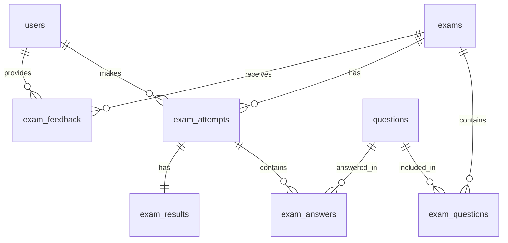
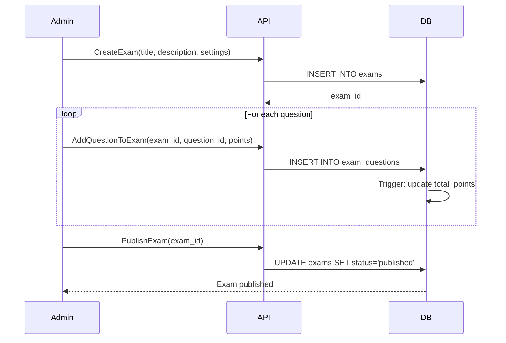
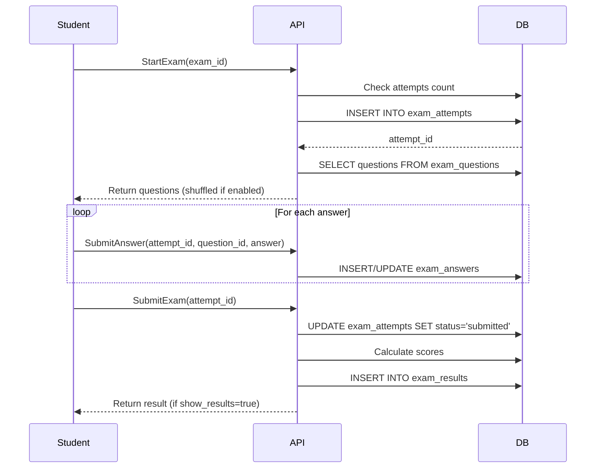
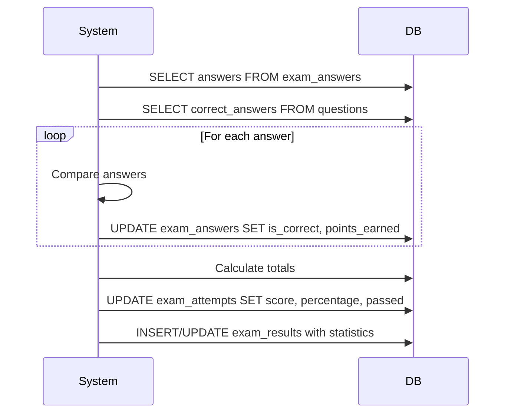
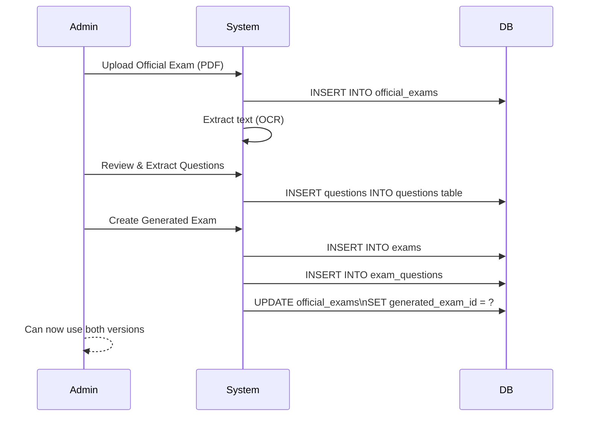
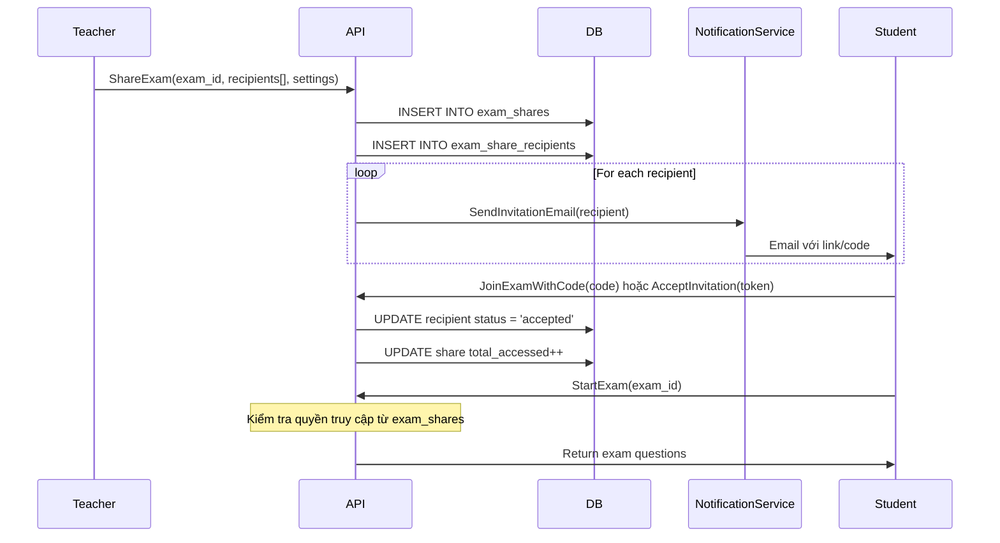
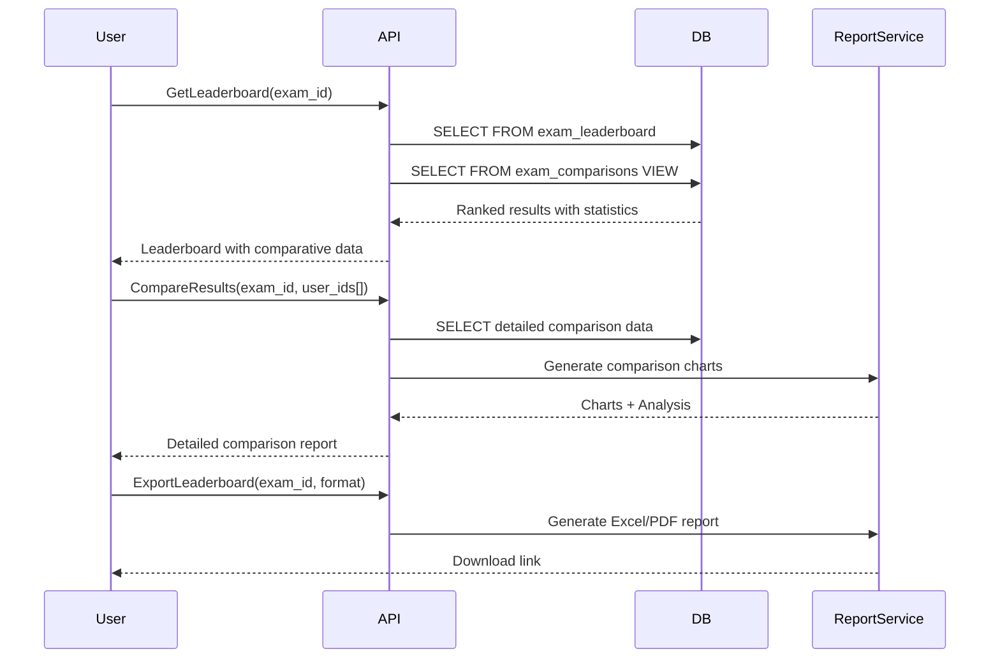

# Exam System Architecture Documentation

## Tổng quan

Hệ thống Exam trong **exam-bank-system** quản lý việc tạo, phân phối và đánh giá các bài kiểm tra, bài thi. Hệ thống sử dụng PostgreSQL với thiết kế normalized database, gRPC cho communication và Go cho backend implementation.

### ⚠️ Lưu ý quan trọng về Phân loại Đề thi

**Hệ thống cần quản lý 2 loại đề thi khác nhau:**

1. **Đề thi THẬT (Official Exams)** 
   - Từ các trường, Sở GD&ĐT, Bộ GD&ĐT, khu vực, quốc gia
   - Thường là file PDF, images, Word
   - Cần metadata chi tiết: năm học, tỉnh/thành, trường, kỳ thi, mã đề
   - Sử dụng bảng `official_exams` (đề xuất ở cuối document)

2. **Đề thi TẠO (Generated Exams)**
   - Tạo từ ngân hàng câu hỏi
   - Interactive, có thể làm online
   - Tự động chấm điểm
   - Sử dụng bảng `exams` (hiện tại)

### 📦 Tích hợp với Model Exam cũ (Exam.md)

Document này đã được cập nhật để tích hợp các fields từ thiết kế cũ trong Exam.md:
- **ExamCategory**: THUONG_XUYEN_MIENG, GIUA_KI_I/II, CUOI_KI_I/II, HOC_SINH_GIOI, TUYEN_SINH
- **ExamForm**: TRAC_NGHIEM, TU_LUAN, KET_HOP, FORM_2018, FORM_2025
- **Description dạng JSONB**: Chứa schoolYear, schoolName, province, examDate, etc.
- **Các enums Difficulty**: easy, medium, hard, expert

Tất cả các fields này đã được comment rõ ràng ý nghĩa trong các bảng dưới đây.

## Kiến trúc Database

### Database Schema Overview

Hệ thống Exam sử dụng 6 bảng chính với quan hệ normalized:



## Chi tiết các bảng

### 1. Bảng `exams`

Bảng chính lưu trữ định nghĩa và cấu hình của các bài thi. Bảng này đã được cập nhật để tương thích với model Exam từ thiết kế cũ (Exam.md) nhưng vẫn giữ các improvements từ migration hiện tại.

**Note:** Bảng này được thiết kế cho đề thi TẠO từ ngân hàng câu hỏi (Generated Exams). Đối với đề thi THẬT từ các trường/sở, sử dụng bảng `official_exams` riêng biệt.

```sql
CREATE TABLE exams (
    -- Primary key
    id UUID DEFAULT gen_random_uuid() PRIMARY KEY,
    
    -- Basic Information
    title VARCHAR(500) NOT NULL,           -- Tiêu đề của đề thi
    description JSONB,                      -- Mô tả chi tiết dạng JSON (từ Exam.md)
                                           -- Chứa: schoolYear, schoolName, province, examDate, examTime, etc.
    instructions TEXT,                      -- Hướng dẫn làm bài
    
    -- Exam Classification (từ Exam.md)
    form VARCHAR(50),                      -- Hình thức: TRAC_NGHIEM, TU_LUAN, KET_HOP, FORM_2018, FORM_2025
    exam_category VARCHAR(50),             -- Loại đề: THUONG_XUYEN_MIENG, GIUA_KI_I, CUOI_KI_I, GIUA_KI_II, CUOI_KI_II,
                                           -- KHAO_SAT, DE_CUONG, HOC_SINH_GIOI, TUYEN_SINH, KHAO_SAT_THI_THU
    
    -- Timing and Scoring
    duration_minutes INT NOT NULL DEFAULT 60,  -- Thời gian làm bài (phút)
    total_points INT DEFAULT 0,                -- Tổng điểm (auto-calculated by trigger)
    pass_percentage INT DEFAULT 60,            -- Phần trăm điểm đạt
    average_score DECIMAL(5,2),               -- Điểm trung bình (từ Exam.md) - tính từ exam_results
    
    -- Status Management  
    exam_type exam_type DEFAULT 'practice',    -- Loại: practice, quiz, midterm, final, custom
    status exam_status DEFAULT 'draft',        -- Trạng thái: draft, published, archived
    type VARCHAR(20) DEFAULT 'draft',          -- ExamType từ Exam.md: draft, published, archived (duplicate for compatibility)
    
    -- Settings
    shuffle_questions BOOLEAN DEFAULT false,   -- Xáo trộn câu hỏi
    shuffle_answers BOOLEAN DEFAULT false,     -- Xáo trộn đáp án
    show_results BOOLEAN DEFAULT true,         -- Hiển thị kết quả sau khi nộp bài
    show_answers BOOLEAN DEFAULT false,        -- Hiển thị đáp án đúng
    allow_review BOOLEAN DEFAULT true,         -- Cho phép xem lại bài làm
    max_attempts INT DEFAULT 1,                -- Số lần làm bài tối đa
    
    -- Academic Metadata
    tags TEXT[],                               -- Tags để phân loại và tìm kiếm
    grade INT,                                 -- Khối lớp (1-12)
    subject VARCHAR(50),                       -- Môn học
    chapter VARCHAR(50),                       -- Chương/Bài học
    difficulty VARCHAR(20),                    -- Độ khó: easy, medium, hard, expert
    
    -- Questions Management
    questions INT[],                           -- Mảng ID câu hỏi (từ Exam.md) - for backward compatibility
                                              -- Note: Nên dùng exam_questions table thay vì field này
    
    -- Timestamps and ownership
    created_by UUID REFERENCES users(id),      -- Người tạo đề
    updated_by UUID REFERENCES users(id),      -- Người cập nhật cuối
    published_at TIMESTAMPTZ,                  -- Thời gian xuất bản
    created_at TIMESTAMPTZ DEFAULT CURRENT_TIMESTAMP,  -- Thời gian tạo
    updated_at TIMESTAMPTZ DEFAULT CURRENT_TIMESTAMP   -- Thời gian cập nhật cuối
)
```

#### Cấu trúc description JSONB (từ Exam.md)

```typescript
interface ExamDescription {
  schoolYear?: string;      // Năm học (VD: "2023-2024")
  schoolName?: string;      // Tên trường
  province?: string;        // Tỉnh/thành phố
  examName?: string;        // Tên kỳ thi
  examDate?: string;        // Ngày thi
  examTime?: string;        // Thời gian thi
  examClass?: string;       // Lớp thi
  instructions?: string;    // Hướng dẫn làm bài (có thể duplicate với field instructions)
  additionalInfo?: Record<string, any>; // Thông tin bổ sung
}
```

#### Exam Types và Status

```sql
-- Exam Status Enum
CREATE TYPE exam_status AS ENUM (
    'draft',      -- Đang soạn thảo
    'published',  -- Đã xuất bản, sẵn sàng cho học sinh
    'archived'    -- Đã lưu trữ, không còn hoạt động
);

-- Exam Type Enum  
CREATE TYPE exam_type AS ENUM (
    'practice',   -- Bài tập thực hành
    'quiz',       -- Bài kiểm tra nhanh
    'midterm',    -- Kiểm tra giữa kỳ
    'final',      -- Kiểm tra cuối kỳ
    'custom'      -- Loại tùy chỉnh
);

-- Exam Form Enum (từ Exam.md)
CREATE TYPE exam_form AS ENUM (
    'TRAC_NGHIEM',   -- Trắc nghiệm
    'TU_LUAN',       -- Tự luận
    'KET_HOP',       -- Kết hợp trắc nghiệm và tự luận
    'FORM_2018',     -- Theo form 2018
    'FORM_2025'      -- Theo form 2025
);

-- Exam Category Enum (từ Exam.md)
CREATE TYPE exam_category AS ENUM (
    'THUONG_XUYEN_MIENG',    -- Kiểm tra thường xuyên, miệng
    'GIUA_KI_I',             -- Kiểm tra giữa kỳ 1
    'CUOI_KI_I',             -- Kiểm tra cuối kỳ 1
    'GIUA_KI_II',            -- Kiểm tra giữa kỳ 2
    'CUOI_KI_II',            -- Kiểm tra cuối kỳ 2
    'KHAO_SAT',              -- Khảo sát chất lượng
    'DE_CUONG',              -- Đề cương ôn tập
    'HOC_SINH_GIOI',         -- Thi học sinh giỏi
    'TUYEN_SINH',            -- Thi tuyển sinh
    'KHAO_SAT_THI_THU'       -- Khảo sát, thi thử
);

-- Difficulty Enum (từ Exam.md)
CREATE TYPE difficulty AS ENUM (
    'easy',       -- Dễ
    'medium',     -- Trung bình
    'hard',       -- Khó
    'expert'      -- Rất khó
);
```

### 2. Bảng `exam_questions`

Junction table liên kết exams với questions, cho phép sắp xếp thứ tự và định nghĩa điểm số.

**Note:** Bảng này thay thế cho field `questions INT[]` trong model Exam cũ (Exam.md), cung cấp flexibility và normalization tốt hơn.

```sql
CREATE TABLE exam_questions (
    id UUID DEFAULT gen_random_uuid() PRIMARY KEY,
    
    -- Relationships
    exam_id UUID NOT NULL REFERENCES exams(id) ON DELETE CASCADE,      -- Liên kết với đề thi
    question_id UUID NOT NULL REFERENCES questions(id) ON DELETE CASCADE, -- Liên kết với câu hỏi
    
    -- Question Configuration
    order_number INT NOT NULL,      -- Thứ tự câu hỏi trong đề (1, 2, 3...)
    points INT DEFAULT 1,            -- Điểm cho câu hỏi này trong đề thi
    is_bonus BOOLEAN DEFAULT false,  -- Câu hỏi bonus (không tính vào điểm chính)
    
    -- Metadata
    created_at TIMESTAMPTZ DEFAULT CURRENT_TIMESTAMP,
    
    -- Constraints
    UNIQUE(exam_id, question_id),   -- Một câu hỏi chỉ xuất hiện 1 lần trong đề
    UNIQUE(exam_id, order_number)    -- Không có 2 câu hỏi cùng thứ tự trong 1 đề
)
```

### 3. Bảng `exam_attempts`

Theo dõi từng lần thi của người dùng.

```sql
CREATE TABLE exam_attempts (
    id UUID DEFAULT gen_random_uuid() PRIMARY KEY,
    exam_id UUID NOT NULL REFERENCES exams(id) ON DELETE CASCADE,
    user_id UUID NOT NULL REFERENCES users(id) ON DELETE CASCADE,
    attempt_number INT NOT NULL DEFAULT 1,
    status attempt_status DEFAULT 'in_progress',
    
    -- Scoring
    score DECIMAL(5,2),
    total_points INT,
    percentage DECIMAL(5,2),
    passed BOOLEAN,
    
    -- Timing
    started_at TIMESTAMPTZ DEFAULT CURRENT_TIMESTAMP,
    submitted_at TIMESTAMPTZ,
    time_spent_seconds INT,
    
    -- Additional data
    ip_address INET,
    user_agent TEXT,
    notes TEXT,
    
    UNIQUE(exam_id, user_id, attempt_number)
)
```

#### Attempt Status Enum

```sql
CREATE TYPE attempt_status AS ENUM (
    'in_progress',  -- Đang làm bài
    'submitted',    -- Đã nộp bài
    'graded',       -- Đã chấm điểm
    'cancelled'     -- Đã hủy
);
```

### 4. Bảng `exam_answers`

Lưu trữ câu trả lời của người dùng cho từng câu hỏi.

```sql
CREATE TABLE exam_answers (
    id UUID DEFAULT gen_random_uuid() PRIMARY KEY,
    attempt_id UUID NOT NULL REFERENCES exam_attempts(id) ON DELETE CASCADE,
    question_id UUID NOT NULL REFERENCES questions(id) ON DELETE CASCADE,
    
    -- Answer data (flexible for different question types)
    answer_data JSONB,              -- Lưu trữ câu trả lời thực tế
    is_correct BOOLEAN,             -- Đúng/sai
    points_earned DECIMAL(5,2),     -- Điểm đạt được
    
    -- Timing
    time_spent_seconds INT,         -- Thời gian làm câu này
    answered_at TIMESTAMPTZ DEFAULT CURRENT_TIMESTAMP,
    
    UNIQUE(attempt_id, question_id)
)
```

#### Cấu trúc answer_data JSONB

```typescript
// Trắc nghiệm một lựa chọn
{
  "type": "single_choice",
  "selected_option_id": 123
}

// Trắc nghiệm nhiều lựa chọn
{
  "type": "multiple_choice",
  "selected_option_ids": [123, 124, 126]
}

// Tự luận
{
  "type": "essay",
  "text_answer": "Câu trả lời của học sinh...",
  "attachments": ["file_id_1", "file_id_2"]
}

// Đúng/Sai
{
  "type": "true_false",
  "answer": true
}

// Điền vào chỗ trống
{
  "type": "fill_blank",
  "answers": ["answer1", "answer2"]
}
```

### 5. Bảng `exam_results`

Tổng hợp kết quả và thống kê cho mỗi lần thi.

```sql
CREATE TABLE exam_results (
    id UUID DEFAULT gen_random_uuid() PRIMARY KEY,
    attempt_id UUID UNIQUE NOT NULL REFERENCES exam_attempts(id) ON DELETE CASCADE,
    
    -- Statistics
    total_questions INT NOT NULL,
    correct_answers INT DEFAULT 0,
    incorrect_answers INT DEFAULT 0,
    unanswered INT DEFAULT 0,
    
    -- Score breakdown by question type
    score_breakdown JSONB,
    
    -- Performance metrics
    accuracy_percentage DECIMAL(5,2),
    avg_time_per_question DECIMAL(8,2),
    
    -- Feedback
    feedback TEXT,
    grade VARCHAR(2), -- A+, A, B+, B, C, D, F
    
    created_at TIMESTAMPTZ DEFAULT CURRENT_TIMESTAMP
)
```

#### Cấu trúc score_breakdown JSONB

```json
{
  "single_choice": {
    "total": 10,
    "correct": 8,
    "points_earned": 8,
    "max_points": 10
  },
  "multiple_choice": {
    "total": 5,
    "correct": 4,
    "points_earned": 12,
    "max_points": 15
  },
  "essay": {
    "total": 2,
    "graded": 2,
    "points_earned": 18,
    "max_points": 20
  }
}
```

### 6. Bảng `exam_feedback`

Lưu trữ phản hồi và đánh giá từ người dùng về bài thi.

```sql
CREATE TABLE exam_feedback (
    id UUID DEFAULT gen_random_uuid() PRIMARY KEY,
    exam_id UUID NOT NULL REFERENCES exams(id) ON DELETE CASCADE,
    user_id UUID NOT NULL REFERENCES users(id) ON DELETE CASCADE,
    attempt_id UUID REFERENCES exam_attempts(id) ON DELETE CASCADE,
    
    rating INT CHECK (rating >= 1 AND rating <= 5),
    difficulty_rating INT CHECK (difficulty_rating >= 1 AND difficulty_rating <= 5),
    content TEXT,
    
    created_at TIMESTAMPTZ DEFAULT CURRENT_TIMESTAMP
)
```

## Go Entity Models

### Exam Entity

```go
// File: apps/backend/internal/entity/exam.go

type ExamStatus string

const (
    ExamStatusDraft     ExamStatus = "draft"
    ExamStatusPublished ExamStatus = "published"
    ExamStatusArchived  ExamStatus = "archived"
)

type ExamType string

const (
    ExamTypePractice ExamType = "practice"
    ExamTypeQuiz     ExamType = "quiz"
    ExamTypeMidterm  ExamType = "midterm"
    ExamTypeFinal    ExamType = "final"
    ExamTypeCustom   ExamType = "custom"
)

type Exam struct {
    // Primary Key
    ID              string     `json:"id" db:"id"`                           // UUID của đề thi
    
    // Basic Information
    Title           string     `json:"title" db:"title"`                     // Tiêu đề đề thi
    Description     JsonValue  `json:"description" db:"description"`        // Mô tả dạng JSON (từ Exam.md)
    Instructions    string     `json:"instructions" db:"instructions"`       // Hướng dẫn làm bài
    
    // Exam Classification (từ Exam.md)
    Form            ExamForm      `json:"form" db:"form"`                    // Hình thức: TRAC_NGHIEM, TU_LUAN, KET_HOP
    ExamCategory    ExamCategory  `json:"examCategory" db:"exam_category"`   // Loại đề: GIUA_KI, CUOI_KI, etc.
    
    // Timing and Scoring  
    DurationMinutes int        `json:"duration_minutes" db:"duration_minutes"` // Thời gian làm bài
    Duration        int        `json:"duration" db:"duration_minutes"`         // Alias for compatibility
    TotalPoints     int        `json:"total_points" db:"total_points"`         // Tổng điểm
    PassPercentage  int        `json:"pass_percentage" db:"pass_percentage"`   // Phần trăm đạt
    AverageScore    *float64   `json:"averageScore" db:"average_score"`        // Điểm TB (từ Exam.md)
    
    // Status Management
    ExamType        ExamType   `json:"exam_type" db:"exam_type"`            // practice, quiz, midterm, final
    Status          ExamStatus `json:"status" db:"status"`                  // draft, published, archived
    Type            ExamType   `json:"type"`                                 // Alias for ExamType (Exam.md)
    
    // Settings
    ShuffleQuestions bool `json:"shuffle_questions" db:"shuffle_questions"`
    ShuffleAnswers   bool `json:"shuffle_answers" db:"shuffle_answers"`
    ShowResults      bool `json:"show_results" db:"show_results"`
    ShowAnswers      bool `json:"show_answers" db:"show_answers"`
    AllowReview      bool `json:"allow_review" db:"allow_review"`
    MaxAttempts      int  `json:"max_attempts" db:"max_attempts"`
    
    // Academic Metadata
    Tags       []string    `json:"tags" db:"tags"`                      // Tags phân loại
    Grade      int         `json:"grade" db:"grade"`                    // Khối lớp (từ Exam.md là Int)
    Subject    string      `json:"subject" db:"subject"`                // Môn học
    Chapter    string      `json:"chapter" db:"chapter"`                // Chương/Bài
    Difficulty Difficulty  `json:"difficulty" db:"difficulty"`          // enum: easy, medium, hard
    
    // Questions Management
    Questions   []int      `json:"questions"`                            // Mảng ID câu hỏi (từ Exam.md)
    QuestionIDs []string   `json:"question_ids"`                         // For string IDs
    
    // Timestamps and Ownership
    CreatedBy   string     `json:"created_by" db:"created_by"`          // ID người tạo
    UpdatedBy   string     `json:"updated_by" db:"updated_by"`          // ID người cập nhật
    PublishedAt *time.Time `json:"published_at" db:"published_at"`      // Thời gian xuất bản
    CreatedAt   time.Time  `json:"created_at" db:"created_at"`          // Thời gian tạo
    UpdatedAt   time.Time  `json:"updated_at" db:"updated_at"`          // Thời gian cập nhật
    
    // Relations (loaded separately)
    Creator       *User          `json:"creator,omitempty" db:"-"`       // Relation với User (từ Exam.md)
    ExamResults   []ExamResult   `json:"examResults,omitempty" db:"-"`   // Kết quả thi
    ExamQuestions []ExamQuestion `json:"examQuestions,omitempty" db:"-"`  // Chi tiết câu hỏi
}

// Enums từ Exam.md

// Difficulty enum
type Difficulty string

const (
    DifficultyEasy   Difficulty = "easy"
    DifficultyMedium Difficulty = "medium"  
    DifficultyHard   Difficulty = "hard"
    DifficultyExpert Difficulty = "expert"
)

// ExamForm enum (từ Exam.md)
type ExamForm string

const (
    ExamFormTracNghiem ExamForm = "TRAC_NGHIEM"  // Trắc nghiệm
    ExamFormTuLuan     ExamForm = "TU_LUAN"      // Tự luận
    ExamFormKetHop     ExamForm = "KET_HOP"      // Kết hợp
    ExamForm2018       ExamForm = "FORM_2018"    // Form 2018
    ExamForm2025       ExamForm = "FORM_2025"    // Form 2025
)

// ExamCategory enum (từ Exam.md)
type ExamCategory string

const (
    ExamCategoryThuongXuyenMieng ExamCategory = "THUONG_XUYEN_MIENG"
    ExamCategoryGiuaKi1          ExamCategory = "GIUA_KI_I"
    ExamCategoryCuoiKi1          ExamCategory = "CUOI_KI_I"
    ExamCategoryGiuaKi2          ExamCategory = "GIUA_KI_II"
    ExamCategoryCuoiKi2          ExamCategory = "CUOI_KI_II"
    ExamCategoryKhaoSat          ExamCategory = "KHAO_SAT"
    ExamCategoryDeCuong          ExamCategory = "DE_CUONG"
    ExamCategoryHocSinhGioi      ExamCategory = "HOC_SINH_GIOI"
    ExamCategoryTuyenSinh        ExamCategory = "TUYEN_SINH"
    ExamCategoryKhaoSatThiThu    ExamCategory = "KHAO_SAT_THI_THU"
)
```

### ExamAttempt Entity

```go
// File: apps/backend/internal/entity/exam_attempt.go

type AttemptStatus string

const (
    AttemptStatusInProgress AttemptStatus = "in_progress"
    AttemptStatusSubmitted  AttemptStatus = "submitted"
    AttemptStatusGraded     AttemptStatus = "graded"
    AttemptStatusCancelled  AttemptStatus = "cancelled"
)

type ExamAttempt struct {
    ID            string        `json:"id" db:"id"`
    ExamID        string        `json:"exam_id" db:"exam_id"`
    UserID        string        `json:"user_id" db:"user_id"`
    AttemptNumber int           `json:"attempt_number" db:"attempt_number"`
    Status        AttemptStatus `json:"status" db:"status"`
    
    // Scoring
    Score       float64 `json:"score" db:"score"`
    TotalPoints int     `json:"total_points" db:"total_points"`
    Percentage  float64 `json:"percentage" db:"percentage"`
    Passed      bool    `json:"passed" db:"passed"`
    
    // Timing
    StartedAt   time.Time  `json:"started_at" db:"started_at"`
    SubmittedAt *time.Time `json:"submitted_at" db:"submitted_at"`
    TimeSpent   int        `json:"time_spent_seconds" db:"time_spent_seconds"`
    
    // Additional data
    IPAddress string `json:"ip_address" db:"ip_address"`
    UserAgent string `json:"user_agent" db:"user_agent"`
    Notes     string `json:"notes" db:"notes"`
    
    // Relations
    Exam    *Exam         `json:"exam,omitempty"`
    Answers []ExamAnswer  `json:"answers,omitempty"`
    Result  *ExamResult   `json:"result,omitempty"`
}
```

## gRPC Protocol Buffers

### exam.proto

```proto
syntax = "proto3";

package v1;

import "common/common.proto";
import "google/protobuf/timestamp.proto";

option go_package = "github.com/AnhPhan49/exam-bank-system/apps/backend/pkg/proto/v1";

// Exam status enum
enum ExamStatus {
  EXAM_STATUS_UNSPECIFIED = 0;
  EXAM_STATUS_DRAFT = 1;
  EXAM_STATUS_PUBLISHED = 2;
  EXAM_STATUS_ARCHIVED = 3;
}

// Exam type enum
enum ExamType {
  EXAM_TYPE_UNSPECIFIED = 0;
  EXAM_TYPE_PRACTICE = 1;
  EXAM_TYPE_QUIZ = 2;
  EXAM_TYPE_MIDTERM = 3;
  EXAM_TYPE_FINAL = 4;
  EXAM_TYPE_CUSTOM = 5;
}

// Attempt status enum
enum AttemptStatus {
  ATTEMPT_STATUS_UNSPECIFIED = 0;
  ATTEMPT_STATUS_IN_PROGRESS = 1;
  ATTEMPT_STATUS_SUBMITTED = 2;
  ATTEMPT_STATUS_GRADED = 3;
  ATTEMPT_STATUS_CANCELLED = 4;
}

// Exam message
message Exam {
  string id = 1;
  string title = 2;
  string description = 3;
  string instructions = 4;
  int32 duration_minutes = 5;
  int32 total_points = 6;
  int32 pass_percentage = 7;
  ExamType exam_type = 8;
  ExamStatus status = 9;
  
  // Settings
  bool shuffle_questions = 10;
  bool shuffle_answers = 11;
  bool show_results = 12;
  bool show_answers = 13;
  bool allow_review = 14;
  int32 max_attempts = 15;
  
  // Metadata
  repeated string tags = 16;
  string grade = 17;
  string subject = 18;
  string chapter = 19;
  string difficulty = 20;
  
  // Timestamps
  string created_by = 21;
  string updated_by = 22;
  google.protobuf.Timestamp published_at = 23;
  google.protobuf.Timestamp created_at = 24;
  google.protobuf.Timestamp updated_at = 25;
  
  // Relations
  repeated ExamQuestion questions = 26;
}

// ExamQuestion message
message ExamQuestion {
  string id = 1;
  string exam_id = 2;
  string question_id = 3;
  int32 order_number = 4;
  int32 points = 5;
  bool is_bonus = 6;
}

// ExamAttempt message
message ExamAttempt {
  string id = 1;
  string exam_id = 2;
  string user_id = 3;
  int32 attempt_number = 4;
  AttemptStatus status = 5;
  
  // Scoring
  double score = 6;
  int32 total_points = 7;
  double percentage = 8;
  bool passed = 9;
  
  // Timing
  google.protobuf.Timestamp started_at = 10;
  google.protobuf.Timestamp submitted_at = 11;
  int32 time_spent_seconds = 12;
  
  // Additional
  string ip_address = 13;
  string user_agent = 14;
  string notes = 15;
}

// Service definitions
service ExamService {
  // Exam management
  rpc CreateExam(CreateExamRequest) returns (CreateExamResponse);
  rpc UpdateExam(UpdateExamRequest) returns (UpdateExamResponse);
  rpc DeleteExam(DeleteExamRequest) returns (DeleteExamResponse);
  rpc GetExam(GetExamRequest) returns (GetExamResponse);
  rpc ListExams(ListExamsRequest) returns (ListExamsResponse);
  rpc PublishExam(PublishExamRequest) returns (PublishExamResponse);
  rpc ArchiveExam(ArchiveExamRequest) returns (ArchiveExamResponse);
  
  // Question management
  rpc AddQuestionToExam(AddQuestionRequest) returns (AddQuestionResponse);
  rpc RemoveQuestionFromExam(RemoveQuestionRequest) returns (RemoveQuestionResponse);
  rpc ReorderQuestions(ReorderQuestionsRequest) returns (ReorderQuestionsResponse);
  
  // Exam taking
  rpc StartExam(StartExamRequest) returns (StartExamResponse);
  rpc SubmitAnswer(SubmitAnswerRequest) returns (SubmitAnswerResponse);
  rpc SubmitExam(SubmitExamRequest) returns (SubmitExamResponse);
  rpc GetAttempt(GetAttemptRequest) returns (GetAttemptResponse);
  
  // Results and analytics
  rpc GetExamResult(GetExamResultRequest) returns (GetExamResultResponse);
  rpc GetExamStatistics(GetExamStatisticsRequest) returns (GetExamStatisticsResponse);
  rpc GetUserExamHistory(GetUserExamHistoryRequest) returns (GetUserExamHistoryResponse);
  
  // Feedback
  rpc SubmitFeedback(SubmitFeedbackRequest) returns (SubmitFeedbackResponse);
  rpc GetExamFeedback(GetExamFeedbackRequest) returns (GetExamFeedbackResponse);
}
```

## Database Triggers và Functions

### Auto-update total_points

```sql
-- Function để tính tổng điểm khi exam_questions thay đổi
CREATE OR REPLACE FUNCTION calculate_exam_total_points()
RETURNS TRIGGER AS $$
BEGIN
    UPDATE exams
    SET total_points = (
        SELECT COALESCE(SUM(points), 0)
        FROM exam_questions
        WHERE exam_id = COALESCE(NEW.exam_id, OLD.exam_id)
        AND is_bonus = false
    )
    WHERE id = COALESCE(NEW.exam_id, OLD.exam_id);
    RETURN NEW;
END;
$$ LANGUAGE plpgsql;

-- Trigger
CREATE TRIGGER update_exam_total_points
    AFTER INSERT OR UPDATE OR DELETE ON exam_questions
    FOR EACH ROW
    EXECUTE FUNCTION calculate_exam_total_points();
```

### Auto-update updated_at

```sql
-- Function để update timestamp
CREATE OR REPLACE FUNCTION update_updated_at_column()
RETURNS TRIGGER AS $$
BEGIN
    NEW.updated_at = CURRENT_TIMESTAMP;
    RETURN NEW;
END;
$$ LANGUAGE plpgsql;

-- Trigger
CREATE TRIGGER update_exams_updated_at
    BEFORE UPDATE ON exams
    FOR EACH ROW
    EXECUTE FUNCTION update_updated_at_column();
```

## API Workflow

### 1. Quy trình tạo đề thi



### 2. Quy trình làm bài thi



### 3. Quy trình chấm điểm



## Repository Pattern Implementation

### ExamRepository Interface

```go
// File: apps/backend/internal/repository/interfaces/exam_repository.go

type ExamRepository interface {
    // Basic CRUD
    Create(ctx context.Context, exam *entity.Exam) error
    Update(ctx context.Context, exam *entity.Exam) error
    Delete(ctx context.Context, examID string) error
    GetByID(ctx context.Context, examID string) (*entity.Exam, error)
    List(ctx context.Context, filters ExamFilters, pagination Pagination) ([]*entity.Exam, int, error)
    
    // Status management
    Publish(ctx context.Context, examID string) error
    Archive(ctx context.Context, examID string) error
    
    // Question management
    AddQuestion(ctx context.Context, eq *entity.ExamQuestion) error
    RemoveQuestion(ctx context.Context, examID, questionID string) error
    ReorderQuestions(ctx context.Context, examID string, order map[string]int) error
    GetQuestions(ctx context.Context, examID string) ([]*entity.ExamQuestion, error)
    
    // Attempt management
    CreateAttempt(ctx context.Context, attempt *entity.ExamAttempt) error
    GetAttempt(ctx context.Context, attemptID string) (*entity.ExamAttempt, error)
    ListUserAttempts(ctx context.Context, userID, examID string) ([]*entity.ExamAttempt, error)
    
    // Answer management
    SaveAnswer(ctx context.Context, answer *entity.ExamAnswer) error
    GetAnswers(ctx context.Context, attemptID string) ([]*entity.ExamAnswer, error)
    
    // Results
    SaveResult(ctx context.Context, result *entity.ExamResult) error
    GetResult(ctx context.Context, attemptID string) (*entity.ExamResult, error)
    
    // Statistics
    GetExamStatistics(ctx context.Context, examID string) (*ExamStatistics, error)
    GetUserPerformance(ctx context.Context, userID, examID string) (*UserPerformance, error)
}
```

## Service Layer

### ExamService Implementation

```go
// File: apps/backend/internal/service/domain_service/exam/exam_service.go

type ExamService struct {
    repo       repository.ExamRepository
    questionRepo repository.QuestionRepository
    userRepo   repository.UserRepository
    logger     *zap.Logger
}

func (s *ExamService) CreateExam(ctx context.Context, req *CreateExamRequest) (*entity.Exam, error) {
    // Validate permissions
    if !hasPermission(ctx, "exam:create") {
        return nil, ErrUnauthorized
    }
    
    // Create exam
    exam := &entity.Exam{
        ID:              uuid.New().String(),
        Title:           req.Title,
        Description:     req.Description,
        Instructions:    req.Instructions,
        DurationMinutes: req.DurationMinutes,
        PassPercentage:  req.PassPercentage,
        ExamType:        req.ExamType,
        Status:          entity.ExamStatusDraft,
        // ... other fields
        CreatedBy:       getUserID(ctx),
        CreatedAt:       time.Now(),
        UpdatedAt:       time.Now(),
    }
    
    if err := s.repo.Create(ctx, exam); err != nil {
        return nil, fmt.Errorf("failed to create exam: %w", err)
    }
    
    // Add questions if provided
    for i, qID := range req.QuestionIDs {
        eq := &entity.ExamQuestion{
            ID:          uuid.New().String(),
            ExamID:      exam.ID,
            QuestionID:  qID,
            OrderNumber: i + 1,
            Points:      req.QuestionPoints[i],
        }
        if err := s.repo.AddQuestion(ctx, eq); err != nil {
            s.logger.Error("failed to add question", zap.Error(err))
        }
    }
    
    return exam, nil
}

func (s *ExamService) StartExam(ctx context.Context, examID string) (*entity.ExamAttempt, error) {
    userID := getUserID(ctx)
    
    // Get exam
    exam, err := s.repo.GetByID(ctx, examID)
    if err != nil {
        return nil, err
    }
    
    // Check if exam is published
    if exam.Status != entity.ExamStatusPublished {
        return nil, ErrExamNotAvailable
    }
    
    // Check attempt limit
    attempts, err := s.repo.ListUserAttempts(ctx, userID, examID)
    if err != nil {
        return nil, err
    }
    
    if len(attempts) >= exam.MaxAttempts {
        return nil, ErrMaxAttemptsReached
    }
    
    // Create new attempt
    attempt := &entity.ExamAttempt{
        ID:            uuid.New().String(),
        ExamID:        examID,
        UserID:        userID,
        AttemptNumber: len(attempts) + 1,
        Status:        entity.AttemptStatusInProgress,
        StartedAt:     time.Now(),
    }
    
    if err := s.repo.CreateAttempt(ctx, attempt); err != nil {
        return nil, err
    }
    
    return attempt, nil
}

func (s *ExamService) SubmitExam(ctx context.Context, attemptID string) (*entity.ExamResult, error) {
    // Get attempt
    attempt, err := s.repo.GetAttempt(ctx, attemptID)
    if err != nil {
        return nil, err
    }
    
    // Validate user
    if attempt.UserID != getUserID(ctx) {
        return nil, ErrUnauthorized
    }
    
    // Get answers
    answers, err := s.repo.GetAnswers(ctx, attemptID)
    if err != nil {
        return nil, err
    }
    
    // Calculate scores
    var totalScore float64
    var correctCount int
    
    for _, answer := range answers {
        if answer.IsCorrect {
            totalScore += answer.PointsEarned
            correctCount++
        }
    }
    
    // Update attempt
    now := time.Now()
    attempt.Status = entity.AttemptStatusSubmitted
    attempt.SubmittedAt = &now
    attempt.Score = totalScore
    attempt.Percentage = (totalScore / float64(attempt.TotalPoints)) * 100
    attempt.Passed = attempt.Percentage >= float64(s.getExamPassPercentage(ctx, attempt.ExamID))
    attempt.TimeSpent = int(now.Sub(attempt.StartedAt).Seconds())
    
    if err := s.repo.UpdateAttempt(ctx, attempt); err != nil {
        return nil, err
    }
    
    // Create result
    result := &entity.ExamResult{
        ID:                uuid.New().String(),
        AttemptID:         attemptID,
        TotalQuestions:    len(answers),
        CorrectAnswers:    correctCount,
        IncorrectAnswers:  len(answers) - correctCount,
        AccuracyPercentage: float64(correctCount) / float64(len(answers)) * 100,
        // ... other calculations
    }
    
    if err := s.repo.SaveResult(ctx, result); err != nil {
        return nil, err
    }
    
    return result, nil
}
```

## Security và Permissions

### Permission Matrix

| Action | Student | Teacher | Admin |
|--------|---------|---------|--------|
| View published exams | ✅ | ✅ | ✅ |
| View draft exams | ❌ | Own only | ✅ |
| Create exam | ❌ | ✅ | ✅ |
| Edit exam | ❌ | Own only | ✅ |
| Delete exam | ❌ | Own draft only | ✅ |
| Publish exam | ❌ | Own only | ✅ |
| Take exam | ✅ | ✅ | ✅ |
| View own results | ✅ | ✅ | ✅ |
| View all results | ❌ | Own exams | ✅ |
| Export results | ❌ | Own exams | ✅ |

### Data Validation Rules

```go
// Validation rules
const (
    MinExamTitle       = 3
    MaxExamTitle       = 500
    MinDuration        = 5
    MaxDuration        = 480
    MinPassPercentage  = 0
    MaxPassPercentage  = 100
    MinQuestions       = 1
    MaxQuestions       = 200
    MinPoints          = 0
    MaxPoints          = 100
)

func ValidateExam(exam *entity.Exam) error {
    if len(exam.Title) < MinExamTitle || len(exam.Title) > MaxExamTitle {
        return fmt.Errorf("title must be between %d and %d characters", MinExamTitle, MaxExamTitle)
    }
    
    if exam.DurationMinutes < MinDuration || exam.DurationMinutes > MaxDuration {
        return fmt.Errorf("duration must be between %d and %d minutes", MinDuration, MaxDuration)
    }
    
    if exam.PassPercentage < MinPassPercentage || exam.PassPercentage > MaxPassPercentage {
        return fmt.Errorf("pass percentage must be between %d and %d", MinPassPercentage, MaxPassPercentage)
    }
    
    return nil
}
```

## Performance Optimization

### Indexes

```sql
-- Performance critical indexes
CREATE INDEX idx_exams_status_published_at ON exams(status, published_at DESC) 
    WHERE status = 'published';

CREATE INDEX idx_exam_attempts_user_exam ON exam_attempts(user_id, exam_id);

CREATE INDEX idx_exam_answers_attempt_correct ON exam_answers(attempt_id, is_correct);

-- Full text search
CREATE INDEX idx_exams_fulltext ON exams 
    USING GIN(to_tsvector('english', title || ' ' || COALESCE(description, '')));
```

### Caching Strategy

```go
// Cache keys
const (
    ExamCacheKey         = "exam:%s"
    ExamQuestionsCacheKey = "exam:%s:questions"
    UserAttemptsCacheKey  = "user:%s:exam:%s:attempts"
    ExamStatsCacheKey     = "exam:%s:stats"
)

// Cache TTL
const (
    ExamCacheTTL      = 1 * time.Hour
    QuestionsCacheTTL = 30 * time.Minute
    StatsCacheTTL     = 5 * time.Minute
)
```

## Monitoring và Analytics

### Metrics to Track

1. **Exam Metrics**
   - Total exams created
   - Exams by status
   - Average questions per exam
   - Popular subjects/grades

2. **Attempt Metrics**
   - Total attempts
   - Average attempts per exam
   - Completion rate
   - Pass/fail ratio

3. **Performance Metrics**
   - Average score by exam
   - Time spent distribution
   - Question difficulty analysis
   - User performance trends

### Sample Queries

```sql
-- Most attempted exams
SELECT e.id, e.title, COUNT(ea.id) as attempt_count
FROM exams e
JOIN exam_attempts ea ON e.id = ea.exam_id
WHERE e.status = 'published'
GROUP BY e.id, e.title
ORDER BY attempt_count DESC
LIMIT 10;

-- Average score by difficulty
SELECT e.difficulty, AVG(ea.percentage) as avg_score
FROM exams e
JOIN exam_attempts ea ON e.id = ea.exam_id
WHERE ea.status = 'graded'
GROUP BY e.difficulty;

-- Question performance
SELECT 
    eq.question_id,
    COUNT(CASE WHEN ea.is_correct THEN 1 END) as correct_count,
    COUNT(*) as total_attempts,
    AVG(ea.time_spent_seconds) as avg_time
FROM exam_questions eq
JOIN exam_answers ea ON eq.question_id = ea.question_id
GROUP BY eq.question_id;
```

## Tích hợp với các hệ thống khác

### Integration với Question Bank

- Exam system sử dụng question_id từ questions table
- Có thể import questions theo tags, subject, grade
- Support randomization từ question pool

### Integration với User System

- Sử dụng user_id cho ownership và attempts
- Role-based access control
- Track user learning progress

### Integration với Notification System

- Notify khi exam published
- Remind về upcoming exams
- Send results to users

## Migration và Upgrade Path

### Version Management

```sql
-- Track exam schema version
ALTER TABLE exams ADD COLUMN schema_version INT DEFAULT 1;

-- Migration example: Add new field
ALTER TABLE exams ADD COLUMN IF NOT EXISTS 
    allow_calculator BOOLEAN DEFAULT false;
```

### Backward Compatibility

- Maintain API versioning
- Support legacy exam formats
- Gradual feature rollout

## Troubleshooting Guide

### Common Issues

1. **Exam not visible to students**
   - Check status = 'published'
   - Verify published_at is set
   - Check user permissions

2. **Cannot submit exam**
   - Verify attempt status = 'in_progress'
   - Check duration timeout
   - Validate all required answers

3. **Score calculation incorrect**
   - Check trigger functions
   - Verify points in exam_questions
   - Review is_bonus flag

## Quản lý Đề thi Thật (Official Exams)

### Tổng quan

Hệ thống cần phân biệt 2 loại đề thi:
1. **Đề thi THẬT (Official Exams)**: Từ các trường, sở GD, Bộ GD, quốc tế - thường là PDF/images
2. **Đề thi TẠO (Generated Exams)**: Tạo từ ngân hàng câu hỏi - interactive, auto-grade

Bảng `exams` hiện tại được thiết kế cho đề thi TẠO. Đề thi THẬT cần bảng riêng với metadata phong phú hơn.

### Bảng `official_exams` (Đề xuất)

```sql
CREATE TABLE official_exams (
    id UUID DEFAULT gen_random_uuid() PRIMARY KEY,
    
    -- Basic Information
    title VARCHAR(500) NOT NULL,               -- Tiêu đề đề thi
    exam_code VARCHAR(50),                     -- Mã đề: 001, 002, A, B, C, D
    description TEXT,                           -- Mô tả chi tiết
    
    -- Source & Origin
    source_type VARCHAR(50) NOT NULL,          -- 'ministry', 'department', 'school', 'international'
    institution_name VARCHAR(255),              -- Tên trường/sở/tổ chức
    
    -- Location Information  
    country VARCHAR(100) DEFAULT 'Vietnam',    -- Quốc gia
    province VARCHAR(100),                     -- Tỉnh/thành phố
    district VARCHAR(100),                     -- Quận/huyện
    
    -- Exam Classification
    exam_level VARCHAR(50),                    -- 'national', 'provincial', 'district', 'school'
    exam_category exam_category,               -- Sử dụng enum từ Exam.md
    form exam_form,                            -- Sử dụng enum từ Exam.md
    
    -- Academic Information
    academic_year VARCHAR(20),                 -- Năm học: '2023-2024'
    semester INT,                               -- Học kỳ: 1 hoặc 2
    exam_date DATE,                            -- Ngày thi
    exam_session VARCHAR(50),                  -- Buổi thi: 'morning', 'afternoon'
    
    -- Subject & Grade
    subject VARCHAR(50) NOT NULL,              -- Môn học
    grade INT,                                  -- Khối lớp
    curriculum VARCHAR(50),                    -- Chương trình: 'vietnam_2018', 'vietnam_2025'
    difficulty difficulty,                      -- Sử dụng enum từ Exam.md
    
    -- Content Metadata
    total_questions INT,                       -- Tổng số câu hỏi
    total_points INT,                          -- Tổng điểm
    duration_minutes INT,                      -- Thời gian làm bài
    
    -- Document Management
    has_answer_key BOOLEAN DEFAULT false,      -- Có đáp án kèm theo
    has_solution BOOLEAN DEFAULT false,        -- Có lời giải chi tiết
    file_url TEXT,                            -- URL của file PDF/image
    
    -- Search & Classification
    tags TEXT[],                               -- Tags để tìm kiếm
    topics TEXT[],                             -- Các chủ đề trong đề
    
    -- Linking to Generated Exam
    generated_exam_id UUID REFERENCES exams(id), -- Link tới đề đã convert
    
    -- Status & Quality
    status VARCHAR(20) DEFAULT 'pending',      -- 'pending', 'verified', 'approved'
    verified_by UUID REFERENCES users(id),     -- Người xác thực
    verified_at TIMESTAMPTZ,                   -- Thời gian xác thực
    rating DECIMAL(3,2),                       -- Đánh giá chất lượng
    
    -- Timestamps
    created_by UUID REFERENCES users(id),
    created_at TIMESTAMPTZ DEFAULT CURRENT_TIMESTAMP,
    updated_at TIMESTAMPTZ DEFAULT CURRENT_TIMESTAMP
);
```

### Workflow Đề thi Thật → Đề thi Tạo



### Tích hợp với hệ thống hiện tại

1. **Official Exams**: Lưu trữ, tìm kiếm, download đề gốc
2. **Generated Exams**: Interactive testing từ đề đã convert
3. **Hybrid Approach**: Có thể sử dụng cả 2 cùng lúc

## Exam Sharing & Comparison System

### Tổng quan

**Use Case**: Tạo bài kiểm tra từ ngân hàng câu hỏi → Gửi cho người khác làm → So sánh điểm

**Tình trạng hiện tại**: Hệ thống có nền tảng tốt với khả năng phân biệt đầy đủ các loại và dạng đề thi, nhưng **CHƯA ĐỦ** để đáp ứng yêu cầu chia sẻ có kiểm soát và so sánh điểm.

### ✅ Những gì đã có

- Tạo đề từ ngân hàng câu hỏi (`exam_questions` ↔ `questions`)
- Người dùng làm bài (`exam_attempts`)
- Tính điểm tự động (`exam_results`)
- Thống kê cơ bản (`GetExamStatistics`)

### ❌ Những gì còn thiếu

1. **Cơ chế chia sẻ/gửi đề thi có kiểm soát**
2. **Tính năng so sánh điểm giữa người dùng**
3. **Quản lý nhóm/lớp học**
4. **Giới hạn thời gian truy cập**
5. **Thông báo tự động**

### Database Schema Bổ sung

#### 1. Bảng `exam_shares` - Quản lý chia sẻ đề thi

```sql
CREATE TABLE exam_shares (
    id UUID DEFAULT gen_random_uuid() PRIMARY KEY,
    exam_id UUID NOT NULL REFERENCES exams(id) ON DELETE CASCADE,
    shared_by UUID NOT NULL REFERENCES users(id),
    
    -- Share Configuration
    share_type VARCHAR(20) NOT NULL DEFAULT 'individual',  -- 'individual', 'group', 'public_link'
    access_code VARCHAR(20),                                -- Mã truy cập (optional)
    share_link VARCHAR(500),                                -- Link chia sẻ
    
    -- Access Control
    max_attempts INT DEFAULT 1,                            -- Số lần làm tối đa
    max_recipients INT,                                     -- Số người tối đa
    requires_approval BOOLEAN DEFAULT false,               -- Cần phê duyệt
    
    -- Time Control
    available_from TIMESTAMPTZ,                            -- Có thể truy cập từ
    available_until TIMESTAMPTZ,                           -- Có thể truy cập đến
    expires_at TIMESTAMPTZ,                                -- Hết hạn link
    
    -- Status & Metadata
    status VARCHAR(20) DEFAULT 'active',                   -- 'active', 'expired', 'disabled'
    description TEXT,                                       -- Mô tả mục đích chia sẻ
    
    -- Tracking
    total_recipients INT DEFAULT 0,                        -- Tổng số người được mời
    total_accessed INT DEFAULT 0,                          -- Tổng số người đã truy cập
    total_completed INT DEFAULT 0,                         -- Tổng số người đã hoàn thành
    
    -- Timestamps
    created_at TIMESTAMPTZ DEFAULT CURRENT_TIMESTAMP,
    updated_at TIMESTAMPTZ DEFAULT CURRENT_TIMESTAMP,
    
    -- Constraints
    CHECK (share_type IN ('individual', 'group', 'public_link')),
    CHECK (status IN ('active', 'expired', 'disabled'))
);
```

#### 2. Bảng `exam_share_recipients` - Người được chia sẻ

```sql
CREATE TABLE exam_share_recipients (
    id UUID DEFAULT gen_random_uuid() PRIMARY KEY,
    share_id UUID NOT NULL REFERENCES exam_shares(id) ON DELETE CASCADE,
    
    -- Recipient Info
    user_id UUID REFERENCES users(id),                     -- User ID (nếu có tài khoản)
    email VARCHAR(255),                                     -- Email (nếu chưa có tài khoản)
    group_id UUID REFERENCES exam_groups(id),              -- Group ID (nếu share với group)
    
    -- Status
    status VARCHAR(20) DEFAULT 'pending',                  -- 'pending', 'accepted', 'declined', 'expired'
    invitation_token VARCHAR(100),                         -- Token để verify
    
    -- Tracking
    invited_at TIMESTAMPTZ DEFAULT CURRENT_TIMESTAMP,
    first_accessed_at TIMESTAMPTZ,
    last_accessed_at TIMESTAMPTZ,
    completed_at TIMESTAMPTZ,
    
    -- Constraints
    CHECK (user_id IS NOT NULL OR email IS NOT NULL),      -- Phải có ít nhất user_id hoặc email
    CHECK (status IN ('pending', 'accepted', 'declined', 'expired')),
    UNIQUE(share_id, user_id),                              -- Một user chỉ được mời 1 lần/share
    UNIQUE(share_id, email)                                 -- Một email chỉ được mời 1 lần/share
);
```

#### 3. Bảng `exam_groups` - Nhóm/Lớp học

```sql
CREATE TABLE exam_groups (
    id UUID DEFAULT gen_random_uuid() PRIMARY KEY,
    
    -- Group Information
    name VARCHAR(255) NOT NULL,                            -- Tên nhóm/lớp
    description TEXT,                                       -- Mô tả
    group_code VARCHAR(20) UNIQUE,                         -- Mã nhóm để join
    
    -- Ownership
    created_by UUID NOT NULL REFERENCES users(id),
    
    -- Settings
    is_public BOOLEAN DEFAULT false,                       -- Công khai cho mọi người join
    require_approval BOOLEAN DEFAULT true,                 -- Cần phê duyệt khi join
    max_members INT,                                        -- Số thành viên tối đa
    
    -- Metadata
    subject VARCHAR(50),                                    -- Môn học
    grade INT,                                              -- Khối lớp
    academic_year VARCHAR(20),                              -- Năm học
    institution VARCHAR(255),                               -- Trường/Tổ chức
    
    -- Statistics
    member_count INT DEFAULT 0,                            -- Số thành viên hiện tại
    active_exams INT DEFAULT 0,                            -- Số đề thi đang hoạt động
    
    -- Timestamps
    created_at TIMESTAMPTZ DEFAULT CURRENT_TIMESTAMP,
    updated_at TIMESTAMPTZ DEFAULT CURRENT_TIMESTAMP
);
```

#### 4. Bảng `exam_group_members` - Thành viên nhóm

```sql
CREATE TABLE exam_group_members (
    group_id UUID REFERENCES exam_groups(id) ON DELETE CASCADE,
    user_id UUID REFERENCES users(id) ON DELETE CASCADE,
    
    -- Role & Status
    role VARCHAR(20) DEFAULT 'member',                     -- 'admin', 'moderator', 'member'
    status VARCHAR(20) DEFAULT 'active',                   -- 'pending', 'active', 'inactive', 'banned'
    
    -- Timestamps
    joined_at TIMESTAMPTZ DEFAULT CURRENT_TIMESTAMP,
    approved_at TIMESTAMPTZ,
    last_active_at TIMESTAMPTZ,
    
    PRIMARY KEY(group_id, user_id),
    
    -- Constraints
    CHECK (role IN ('admin', 'moderator', 'member')),
    CHECK (status IN ('pending', 'active', 'inactive', 'banned'))
);
```

#### 5. Bảng `exam_leaderboard` - Xếp hạng

```sql
CREATE TABLE exam_leaderboard (
    exam_id UUID REFERENCES exams(id) ON DELETE CASCADE,
    user_id UUID REFERENCES users(id) ON DELETE CASCADE,
    
    -- Best Attempt Reference
    best_attempt_id UUID REFERENCES exam_attempts(id),
    
    -- Ranking Data
    rank INT NOT NULL,
    score DECIMAL(5,2) NOT NULL,
    percentage DECIMAL(5,2) NOT NULL,
    time_spent_seconds INT,
    
    -- Attempt Statistics
    total_attempts INT DEFAULT 1,
    first_attempt_at TIMESTAMPTZ,
    best_attempt_at TIMESTAMPTZ,
    
    -- Metadata
    grade_letter VARCHAR(2),                                -- A+, A, B+, B, C, D, F
    percentile DECIMAL(5,2),                                -- Phần trăm xếp hạng
    
    -- Timestamps
    updated_at TIMESTAMPTZ DEFAULT CURRENT_TIMESTAMP,
    
    PRIMARY KEY(exam_id, user_id)
);
```

#### 6. View `exam_comparisons` - So sánh kết quả

```sql
CREATE VIEW exam_comparisons AS
SELECT 
    e.id as exam_id,
    e.title,
    e.subject,
    e.grade,
    u.id as user_id,
    u.full_name,
    u.email,
    
    -- Individual Performance
    el.rank,
    el.score,
    el.percentage,
    el.time_spent_seconds,
    el.grade_letter,
    el.total_attempts,
    
    -- Comparative Statistics
    AVG(el.score) OVER (PARTITION BY e.id) as exam_avg_score,
    MAX(el.score) OVER (PARTITION BY e.id) as exam_max_score,
    MIN(el.score) OVER (PARTITION BY e.id) as exam_min_score,
    STDDEV(el.score) OVER (PARTITION BY e.id) as exam_score_stddev,
    
    -- Position Analysis
    COUNT(*) OVER (PARTITION BY e.id) as total_participants,
    el.percentile,
    
    -- Performance vs Average
    (el.score - AVG(el.score) OVER (PARTITION BY e.id)) as score_vs_avg,
    
    -- Time Analysis
    AVG(el.time_spent_seconds) OVER (PARTITION BY e.id) as avg_time_spent,
    (el.time_spent_seconds - AVG(el.time_spent_seconds) OVER (PARTITION BY e.id)) as time_vs_avg
    
FROM exams e
JOIN exam_leaderboard el ON e.id = el.exam_id
JOIN users u ON el.user_id = u.id
ORDER BY e.id, el.rank;
```

### Cập nhật bảng `exams`

```sql
-- Thêm các fields mới cho access control và sharing
ALTER TABLE exams ADD COLUMN access_type VARCHAR(20) DEFAULT 'public';
-- 'public': Ai cũng có thể truy cập
-- 'private': Chỉ creator truy cập được  
-- 'shared': Chỉ những người được chia sẻ
-- 'group': Chỉ thành viên group được chỉ định

ALTER TABLE exams ADD COLUMN allowed_users UUID[];          -- Danh sách user_id được phép truy cập
ALTER TABLE exams ADD COLUMN allowed_groups UUID[];         -- Danh sách group_id được phép truy cập
ALTER TABLE exams ADD COLUMN require_access_code BOOLEAN DEFAULT false;
ALTER TABLE exams ADD COLUMN default_access_code VARCHAR(20);

-- Time-based access control
ALTER TABLE exams ADD COLUMN available_from TIMESTAMPTZ;    -- Có thể truy cập từ thời điểm
ALTER TABLE exams ADD COLUMN available_until TIMESTAMPTZ;   -- Có thể truy cập đến thời điểm

-- Sharing statistics
ALTER TABLE exams ADD COLUMN total_shares INT DEFAULT 0;    -- Tổng số lần được chia sẻ
ALTER TABLE exams ADD COLUMN total_participants INT DEFAULT 0; -- Tổng số người tham gia

-- Add constraints
ALTER TABLE exams ADD CONSTRAINT chk_access_type 
    CHECK (access_type IN ('public', 'private', 'shared', 'group'));
```

### Triggers và Functions bổ sung

#### Auto-update leaderboard

```sql
-- Function để cập nhật leaderboard khi có attempt mới
CREATE OR REPLACE FUNCTION update_exam_leaderboard()
RETURNS TRIGGER AS $$
BEGIN
    -- Chỉ process khi attempt được submit và graded
    IF NEW.status = 'graded' THEN
        -- Insert or update leaderboard
        INSERT INTO exam_leaderboard (
            exam_id, user_id, best_attempt_id, score, percentage, 
            time_spent_seconds, total_attempts, first_attempt_at, best_attempt_at
        )
        VALUES (
            NEW.exam_id, NEW.user_id, NEW.id, NEW.score, NEW.percentage,
            NEW.time_spent_seconds, 1, NEW.started_at, NEW.submitted_at
        )
        ON CONFLICT (exam_id, user_id) DO UPDATE SET
            best_attempt_id = CASE 
                WHEN NEW.score > exam_leaderboard.score THEN NEW.id
                ELSE exam_leaderboard.best_attempt_id
            END,
            score = GREATEST(exam_leaderboard.score, NEW.score),
            percentage = GREATEST(exam_leaderboard.percentage, NEW.percentage),
            time_spent_seconds = CASE
                WHEN NEW.score > exam_leaderboard.score THEN NEW.time_spent_seconds
                ELSE exam_leaderboard.time_spent_seconds
            END,
            total_attempts = exam_leaderboard.total_attempts + 1,
            best_attempt_at = CASE
                WHEN NEW.score > exam_leaderboard.score THEN NEW.submitted_at
                ELSE exam_leaderboard.best_attempt_at
            END,
            updated_at = CURRENT_TIMESTAMP;
            
        -- Recalculate ranks for this exam
        WITH ranked_scores AS (
            SELECT user_id, 
                   RANK() OVER (ORDER BY score DESC, time_spent_seconds ASC) as new_rank,
                   PERCENT_RANK() OVER (ORDER BY score DESC) * 100 as new_percentile
            FROM exam_leaderboard 
            WHERE exam_id = NEW.exam_id
        )
        UPDATE exam_leaderboard el
        SET rank = rs.new_rank,
            percentile = rs.new_percentile,
            grade_letter = CASE
                WHEN rs.new_percentile >= 97 THEN 'A+'
                WHEN rs.new_percentile >= 93 THEN 'A'
                WHEN rs.new_percentile >= 90 THEN 'A-'
                WHEN rs.new_percentile >= 87 THEN 'B+'
                WHEN rs.new_percentile >= 83 THEN 'B'
                WHEN rs.new_percentile >= 80 THEN 'B-'
                WHEN rs.new_percentile >= 77 THEN 'C+'
                WHEN rs.new_percentile >= 73 THEN 'C'
                WHEN rs.new_percentile >= 70 THEN 'C-'
                WHEN rs.new_percentile >= 67 THEN 'D+'
                WHEN rs.new_percentile >= 60 THEN 'D'
                ELSE 'F'
            END
        FROM ranked_scores rs
        WHERE el.exam_id = NEW.exam_id AND el.user_id = rs.user_id;
    END IF;
    
    RETURN NEW;
END;
$$ LANGUAGE plpgsql;

-- Trigger
CREATE TRIGGER update_leaderboard_on_attempt
    AFTER UPDATE ON exam_attempts
    FOR EACH ROW
    EXECUTE FUNCTION update_exam_leaderboard();
```

#### Auto-update sharing statistics

```sql
-- Function để update sharing stats
CREATE OR REPLACE FUNCTION update_sharing_stats()
RETURNS TRIGGER AS $$
BEGIN
    IF TG_OP = 'INSERT' THEN
        -- Update exam total_shares
        UPDATE exams 
        SET total_shares = total_shares + 1
        WHERE id = NEW.exam_id;
        
        -- Update share total_recipients
        UPDATE exam_shares
        SET total_recipients = total_recipients + 1
        WHERE id = NEW.share_id;
        
    ELSIF TG_OP = 'UPDATE' THEN
        -- Track access và completion
        IF OLD.first_accessed_at IS NULL AND NEW.first_accessed_at IS NOT NULL THEN
            UPDATE exam_shares
            SET total_accessed = total_accessed + 1
            WHERE id = NEW.share_id;
        END IF;
        
        IF OLD.completed_at IS NULL AND NEW.completed_at IS NOT NULL THEN
            UPDATE exam_shares
            SET total_completed = total_completed + 1
            WHERE id = NEW.share_id;
        END IF;
    END IF;
    
    RETURN COALESCE(NEW, OLD);
END;
$$ LANGUAGE plpgsql;

CREATE TRIGGER update_share_stats
    AFTER INSERT OR UPDATE ON exam_share_recipients
    FOR EACH ROW
    EXECUTE FUNCTION update_sharing_stats();
```

### gRPC Protocol Buffers mở rộng

#### exam_sharing.proto

```proto
syntax = "proto3";

package v1;

import "common/common.proto";
import "google/protobuf/timestamp.proto";

option go_package = "github.com/AnhPhan49/exam-bank-system/apps/backend/pkg/proto/v1";

// Enums
enum ShareType {
  SHARE_TYPE_UNSPECIFIED = 0;
  SHARE_TYPE_INDIVIDUAL = 1;
  SHARE_TYPE_GROUP = 2;
  SHARE_TYPE_PUBLIC_LINK = 3;
}

enum ShareStatus {
  SHARE_STATUS_UNSPECIFIED = 0;
  SHARE_STATUS_ACTIVE = 1;
  SHARE_STATUS_EXPIRED = 2;
  SHARE_STATUS_DISABLED = 3;
}

enum RecipientStatus {
  RECIPIENT_STATUS_UNSPECIFIED = 0;
  RECIPIENT_STATUS_PENDING = 1;
  RECIPIENT_STATUS_ACCEPTED = 2;
  RECIPIENT_STATUS_DECLINED = 3;
  RECIPIENT_STATUS_EXPIRED = 4;
}

enum GroupMemberRole {
  GROUP_MEMBER_ROLE_UNSPECIFIED = 0;
  GROUP_MEMBER_ROLE_ADMIN = 1;
  GROUP_MEMBER_ROLE_MODERATOR = 2;
  GROUP_MEMBER_ROLE_MEMBER = 3;
}

// Messages
message ExamShare {
  string id = 1;
  string exam_id = 2;
  string shared_by = 3;
  ShareType share_type = 4;
  string access_code = 5;
  string share_link = 6;
  int32 max_attempts = 7;
  int32 max_recipients = 8;
  bool requires_approval = 9;
  google.protobuf.Timestamp available_from = 10;
  google.protobuf.Timestamp available_until = 11;
  google.protobuf.Timestamp expires_at = 12;
  ShareStatus status = 13;
  string description = 14;
  int32 total_recipients = 15;
  int32 total_accessed = 16;
  int32 total_completed = 17;
  google.protobuf.Timestamp created_at = 18;
  google.protobuf.Timestamp updated_at = 19;
}

message ExamGroup {
  string id = 1;
  string name = 2;
  string description = 3;
  string group_code = 4;
  string created_by = 5;
  bool is_public = 6;
  bool require_approval = 7;
  int32 max_members = 8;
  string subject = 9;
  int32 grade = 10;
  string academic_year = 11;
  string institution = 12;
  int32 member_count = 13;
  int32 active_exams = 14;
  google.protobuf.Timestamp created_at = 15;
  google.protobuf.Timestamp updated_at = 16;
}

message LeaderboardEntry {
  string exam_id = 1;
  string user_id = 2;
  string user_name = 3;
  string user_email = 4;
  int32 rank = 5;
  double score = 6;
  double percentage = 7;
  int32 time_spent_seconds = 8;
  string grade_letter = 9;
  double percentile = 10;
  int32 total_attempts = 11;
  google.protobuf.Timestamp best_attempt_at = 12;
}

message ComparisonResult {
  string exam_id = 1;
  string exam_title = 2;
  LeaderboardEntry user_performance = 3;
  ExamStatistics exam_stats = 4;
  repeated LeaderboardEntry top_performers = 5;
  int32 total_participants = 6;
}

message ExamStatistics {
  double avg_score = 1;
  double max_score = 2;
  double min_score = 3;
  double score_stddev = 4;
  double avg_time_spent = 5;
  int32 total_attempts = 6;
  int32 total_participants = 7;
  double pass_rate = 8;
  map<string, int32> grade_distribution = 9; // A+: 5, A: 10, B+: 15, etc.
}
```

### Service Definitions mở rộng

```proto
service ExamSharingService {
  // Sharing Management
  rpc ShareExam(ShareExamRequest) returns (ShareExamResponse);
  rpc GetExamShares(GetExamSharesRequest) returns (GetExamSharesResponse);
  rpc GetSharedExams(GetSharedExamsRequest) returns (GetSharedExamsResponse);
  rpc UpdateShare(UpdateShareRequest) returns (UpdateShareResponse);
  rpc DeleteShare(DeleteShareRequest) returns (DeleteShareResponse);
  rpc JoinExamWithCode(JoinExamWithCodeRequest) returns (JoinExamWithCodeResponse);
  rpc AcceptExamInvitation(AcceptInvitationRequest) returns (AcceptInvitationResponse);
  
  // Group Management
  rpc CreateGroup(CreateGroupRequest) returns (CreateGroupResponse);
  rpc GetGroup(GetGroupRequest) returns (GetGroupResponse);
  rpc ListGroups(ListGroupsRequest) returns (ListGroupsResponse);
  rpc UpdateGroup(UpdateGroupRequest) returns (UpdateGroupResponse);
  rpc DeleteGroup(DeleteGroupRequest) returns (DeleteGroupResponse);
  rpc JoinGroup(JoinGroupRequest) returns (JoinGroupResponse);
  rpc LeaveGroup(LeaveGroupRequest) returns (LeaveGroupResponse);
  rpc AddGroupMembers(AddGroupMembersRequest) returns (AddGroupMembersResponse);
  rpc RemoveGroupMember(RemoveGroupMemberRequest) returns (RemoveGroupMemberResponse);
  rpc ShareExamWithGroup(ShareExamWithGroupRequest) returns (ShareExamWithGroupResponse);
  
  // Comparison & Leaderboard
  rpc GetLeaderboard(GetLeaderboardRequest) returns (GetLeaderboardResponse);
  rpc GetGroupLeaderboard(GetGroupLeaderboardRequest) returns (GetGroupLeaderboardResponse);
  rpc CompareResults(CompareResultsRequest) returns (CompareResultsResponse);
  rpc GetExamStatistics(GetExamStatisticsRequest) returns (GetExamStatisticsResponse);
  rpc GetGroupStatistics(GetGroupStatisticsRequest) returns (GetGroupStatisticsResponse);
  rpc GetUserPerformanceHistory(GetUserPerformanceHistoryRequest) returns (GetUserPerformanceHistoryResponse);
  
  // Export & Reports
  rpc ExportLeaderboard(ExportLeaderboardRequest) returns (ExportLeaderboardResponse);
  rpc ExportComparisonReport(ExportComparisonReportRequest) returns (ExportComparisonReportResponse);
  rpc GeneratePerformanceReport(GeneratePerformanceReportRequest) returns (GeneratePerformanceReportResponse);
}
```

### Repository Pattern mở rộng

#### ExamSharingRepository Interface

```go
// File: apps/backend/internal/repository/interfaces/exam_sharing_repository.go

type ExamSharingRepository interface {
    // Sharing CRUD
    CreateShare(ctx context.Context, share *entity.ExamShare) error
    GetShare(ctx context.Context, shareID string) (*entity.ExamShare, error)
    GetExamShares(ctx context.Context, examID string) ([]*entity.ExamShare, error)
    GetUserSharedExams(ctx context.Context, userID string) ([]*entity.ExamShare, error)
    UpdateShare(ctx context.Context, share *entity.ExamShare) error
    DeleteShare(ctx context.Context, shareID string) error
    
    // Recipients management
    AddRecipients(ctx context.Context, shareID string, recipients []*entity.ExamShareRecipient) error
    GetRecipients(ctx context.Context, shareID string) ([]*entity.ExamShareRecipient, error)
    UpdateRecipientStatus(ctx context.Context, recipientID string, status entity.RecipientStatus) error
    
    // Access control
    CanUserAccessExam(ctx context.Context, userID, examID string) (bool, error)
    GetExamByAccessCode(ctx context.Context, accessCode string) (*entity.Exam, error)
    ValidateShareToken(ctx context.Context, token string) (*entity.ExamShareRecipient, error)
    
    // Group management
    CreateGroup(ctx context.Context, group *entity.ExamGroup) error
    GetGroup(ctx context.Context, groupID string) (*entity.ExamGroup, error)
    ListUserGroups(ctx context.Context, userID string) ([]*entity.ExamGroup, error)
    AddGroupMembers(ctx context.Context, groupID string, members []*entity.ExamGroupMember) error
    RemoveGroupMember(ctx context.Context, groupID, userID string) error
    GetGroupMembers(ctx context.Context, groupID string) ([]*entity.ExamGroupMember, error)
    
    // Leaderboard & Statistics
    GetExamLeaderboard(ctx context.Context, examID string, limit int) ([]*entity.LeaderboardEntry, error)
    GetGroupLeaderboard(ctx context.Context, examID, groupID string) ([]*entity.LeaderboardEntry, error)
    GetExamStatistics(ctx context.Context, examID string) (*entity.ExamStatistics, error)
    CompareUserPerformance(ctx context.Context, examID string, userIDs []string) ([]*entity.ComparisonResult, error)
    GetUserPerformanceHistory(ctx context.Context, userID string, filters PerformanceFilters) ([]*entity.UserPerformance, error)
}
```

### API Workflow mở rộng

#### 1. Quy trình chia sẻ đề thi



#### 2. Quy trình so sánh kết quả



### Security & Permission Matrix mở rộng

| Action | Creator | Shared User | Group Member | Public |
|--------|---------|-------------|--------------|--------|
| View exam details | ✅ | ✅ (if shared) | ✅ (if group shared) | ✅ (if public) |
| Take exam | ✅ | ✅ (if invited) | ✅ (if group shared) | ✅ (if public) |
| Share exam | ✅ | ❌ | ❌ | ❌ |
| View all results | ✅ | Own only | Own only | Own only |
| View leaderboard | ✅ | ✅ (if allowed) | ✅ (if allowed) | ✅ (if public) |
| Export reports | ✅ | ❌ | ❌ (unless admin) | ❌ |
| Manage share settings | ✅ | ❌ | ❌ | ❌ |
| Create groups | ✅ | ✅ | ✅ | ✅ |
| Manage group | Group Admin | ❌ | ✅ (if moderator) | ❌ |

### Performance Optimization mở rộng

#### Additional Indexes

```sql
-- Sharing performance
CREATE INDEX idx_exam_shares_exam_status ON exam_shares(exam_id, status)
    WHERE status = 'active';

CREATE INDEX idx_share_recipients_user_status ON exam_share_recipients(user_id, status);

CREATE INDEX idx_share_recipients_email_token ON exam_share_recipients(email, invitation_token)
    WHERE invitation_token IS NOT NULL;

-- Group performance
CREATE INDEX idx_group_members_user_role ON exam_group_members(user_id, role, status)
    WHERE status = 'active';

CREATE INDEX idx_groups_public_code ON exam_groups(is_public, group_code)
    WHERE is_public = true;

-- Leaderboard performance
CREATE INDEX idx_leaderboard_exam_rank ON exam_leaderboard(exam_id, rank);

CREATE INDEX idx_leaderboard_user_score ON exam_leaderboard(user_id, score DESC);

-- Access control performance
CREATE INDEX idx_exams_access_type ON exams(access_type, status)
    WHERE status = 'published';

-- Comparison view optimization
CREATE INDEX idx_attempts_exam_user_status ON exam_attempts(exam_id, user_id, status)
    WHERE status IN ('submitted', 'graded');
```

#### Caching Strategy mở rộng

```go
// Additional cache keys
const (
    ExamShareCacheKey        = "exam:%s:shares"
    UserSharedExamsCacheKey  = "user:%s:shared_exams"
    LeaderboardCacheKey      = "exam:%s:leaderboard"
    GroupLeaderboardCacheKey = "exam:%s:group:%s:leaderboard"
    ExamStatsCacheKey        = "exam:%s:statistics"
    GroupMembersCacheKey     = "group:%s:members"
    UserGroupsCacheKey       = "user:%s:groups"
    ComparisonCacheKey       = "comparison:%s:users:%s" // exam_id + hash of user_ids
)

// Cache TTL
const (
    SharesCacheTTL      = 15 * time.Minute
    LeaderboardCacheTTL = 5 * time.Minute
    StatisticsCacheTTL  = 10 * time.Minute
    GroupsCacheTTL      = 1 * time.Hour
    ComparisonCacheTTL  = 30 * time.Minute
)
```

### Monitoring & Analytics mở rộng

#### Additional Metrics

1. **Sharing Metrics**
   - Total shares created
   - Share acceptance rate
   - Popular sharing methods
   - Time from share to first access

2. **Group Metrics**
   - Active groups count
   - Average group size
   - Group engagement rate
   - Cross-group performance comparison

3. **Comparison Metrics**
   - Leaderboard views
   - Export frequency
   - Performance improvement trends
   - Competitive engagement indicators

### Sample Queries mở rộng

```sql
-- Top performing groups across exams
SELECT 
    g.name as group_name,
    AVG(el.score) as avg_group_score,
    COUNT(DISTINCT el.exam_id) as exams_taken,
    COUNT(el.user_id) as total_participants
FROM exam_groups g
JOIN exam_group_members gm ON g.id = gm.group_id
JOIN exam_leaderboard el ON gm.user_id = el.user_id
WHERE gm.status = 'active'
GROUP BY g.id, g.name
ORDER BY avg_group_score DESC;

-- Most shared exams
SELECT 
    e.title,
    e.subject,
    COUNT(es.id) as total_shares,
    SUM(es.total_recipients) as total_invitations,
    SUM(es.total_completed) as total_completions,
    (SUM(es.total_completed)::FLOAT / NULLIF(SUM(es.total_recipients), 0)) * 100 as completion_rate
FROM exams e
JOIN exam_shares es ON e.id = es.exam_id
WHERE es.status = 'active'
GROUP BY e.id, e.title, e.subject
ORDER BY total_shares DESC
LIMIT 10;

-- Performance improvement tracking
SELECT 
    u.full_name,
    e.title,
    el.total_attempts,
    first_attempt.score as first_score,
    el.score as best_score,
    (el.score - first_attempt.score) as improvement
FROM exam_leaderboard el
JOIN users u ON el.user_id = u.id
JOIN exams e ON el.exam_id = e.id
JOIN LATERAL (
    SELECT score 
    FROM exam_attempts ea 
    WHERE ea.user_id = el.user_id AND ea.exam_id = el.exam_id
    ORDER BY ea.started_at ASC 
    LIMIT 1
) first_attempt ON true
WHERE el.total_attempts > 1
ORDER BY improvement DESC;
```

## Roadmap và Future Features

### Planned Features

#### **Cấp độ 1 - Ưu tiên cao (1-2 tháng)**
1. **Exam Sharing Core**
   - ✅ Share exam với individuals/groups
   - ✅ Access code system
   - ✅ Time-based access control
   - ✅ Email invitations

2. **Basic Comparison & Leaderboard**
   - ✅ Real-time leaderboard
   - ✅ Basic statistics (avg, min, max)
   - ✅ Rank calculation
   - ✅ Export to Excel/PDF

3. **Group Management**
   - ✅ Create/join groups với codes
   - ✅ Member management
   - ✅ Group-based sharing
   - ✅ Group leaderboards

#### **Cấp độ 2 - Trung bình (2-4 tháng)**
4. **Advanced Analytics**
   - 📊 Interactive dashboards
   - 📈 Performance trend charts
   - 🎯 Detailed comparison reports
   - 📋 Custom report builder

5. **Enhanced Collaboration**
   - 👥 Co-create exams
   - 📚 Share question banks
   - 🔍 Peer review system
   - 💬 Comments & discussions

6. **Notification System**
   - 📧 Smart email notifications
   - 🔔 Real-time in-app alerts
   - 📱 Mobile push notifications
   - ⚡ Webhook integrations

#### **Cấp độ 3 - Nâng cao (6+ tháng)**
7. **Advanced Question Types**
   - 💻 Code execution questions
   - 📎 File upload questions
   - 🔗 Matching questions
   - 📝 Ordering questions

8. **AI Integration**
   - 🤖 Auto-grading for essays
   - 💡 Question recommendation
   - ⚖️ Difficulty adjustment
   - 🛡️ Cheating detection

9. **Proctoring & Security**
   - 🎥 Webcam monitoring
   - 🖥️ Screen recording
   - 🔒 Browser lockdown
   - 📊 Suspicious behavior detection

10. **Gamification**
    - 🏆 Badges & achievements
    - ⭐ Points & XP system
    - 🥇 Tournaments & competitions
    - 📊 Progress tracking

11. **Mobile & Integrations**
    - 📱 Native mobile apps
    - 🔗 LMS integrations (Moodle, Canvas)
    - 📧 Google Classroom sync
    - 📊 Analytics tool exports

## Kết luận và Đánh giá Tổng thể

### 📊 **Tình trạng hệ thống hiện tại**

**Về phân loại đề thi:** ✅ **ĐỦ MẠNH**
- Hệ thống có đầy đủ khả năng phân biệt các loại và dạng đề thi
- 2 loại đề chính: **Đề thi THẬT** (official_exams) và **Đề thi TẠO** (exams)
- Enums phong phú: exam_category, exam_form, difficulty, exam_type
- Metadata chi tiết: grade, subject, chapter, tags, academic_year

**Về use case chia sẻ & so sánh:** ⚠️ **CHƯA ĐỦ**
- Cần bổ sung 5 bảng mới cho sharing & comparison
- Cần 15+ API endpoints mới
- Cần tích hợp với notification system
- Cần UI/UX mới cho dashboard so sánh

### 🏁 **Ʈu tiên triển khai**

| **Cấp độ** | **Thời gian** | **Tính năng chính** | **Độ khó** |
|------------|--------------|----------------------|-------------|
| **1** | 1-2 tháng | Sharing + Leaderboard + Groups | Trung bình |
| **2** | 2-4 tháng | Analytics + Notifications + Collaboration | Cao |
| **3** | 6+ tháng | AI + Proctoring + Mobile + Gamification | Rất cao |

### 📊 **Tác động đến hệ thống hiện tại**

#### **Database Changes:**
- **5 bảng mới**: exam_shares, exam_share_recipients, exam_groups, exam_group_members, exam_leaderboard
- **1 view mới**: exam_comparisons
- **Cập nhật bảng exams**: Thêm 8 fields mới cho access control
- **Triggers & Functions**: Auto-update leaderboard và sharing stats

#### **Backend Changes:**
- **1 service mới**: ExamSharingService với 17 gRPC endpoints
- **1 repository mới**: ExamSharingRepository với 20+ methods
- **Proto files mới**: exam_sharing.proto với messages & enums
- **Entity models mới**: ExamShare, ExamGroup, LeaderboardEntry, etc.

#### **Frontend Changes:**
- **UI mới**: Sharing modal, group management, leaderboard display
- **Dashboard mới**: Comparison charts, statistics, export features
- **Navigation mới**: Group pages, shared exams section
- **Services mới**: exam-sharing.service.ts, group.service.ts

### ⚡ **Rủi ro và Thách thức**

#### **Rủi ro kỹ thuật:**
1. **Performance**: Leaderboard real-time có thể chậm với số lượng lớn
2. **Caching**: Cần cache strategy phức tạp cho sharing & stats
3. **Database**: 5 bảng mới tăng complexity và join operations
4. **Migration**: Cần migration script cho data hiện tại

#### **Rủi ro product:**
1. **UX Complexity**: Quá nhiều tính năng có thể làm rối người dùng
2. **Permission Management**: Hệ thống quyền phức tạp hơn
3. **Privacy Concerns**: Chia sẻ điểm có thể gây tranh cãi
4. **Adoption**: Người dùng có thể không sử dụng hết tính năng

### 🔥 **Khuyến nghị triển khai**

#### **Giai đoạn 1: MVP (4-6 tuần)**
1. **Share exam cơ bản**: Với email/link, không cần group
2. **Leaderboard đơn giản**: Chỉ hiển thị rank và score
3. **Export cơ bản**: Excel/CSV cho kết quả
4. **Access control**: Public/private exam

#### **Giai đoạn 2: Enhanced (6-8 tuần)**
1. **Group management**: Tạo và quản lý nhóm
2. **Advanced comparison**: Charts, statistics, trends
3. **Notification system**: Email và in-app alerts
4. **Permission matrix**: Chi tiết theo role

#### **Giai đoạn 3: Professional (8-12 tuần)**
1. **Advanced analytics**: Dashboard với charts
2. **Collaboration tools**: Co-create, peer review
3. **Integration**: LMS, Google Classroom
4. **Mobile optimization**: Responsive design

### 📋 **Kết luận cuối cùng**

Hệ thống ExamSystem hiện tại có **nền tảng vâng** với khả năng phân biệt đề thi tốt. Tuy nhiên, để đáp ứng đầy đủ yêu cầu **"tạo đề → chia sẻ → so sánh điểm"**, cần **mở rộng đáng kể** về:

- **Database**: +5 bảng, +1 view, +8 fields, +2 functions
- **Backend**: +1 service, +17 endpoints, +1 repository  
- **Frontend**: +5 pages, +10 components, +3 services
- **Thời gian**: 3-6 tháng cho phiên bản đầy đủ
- **Effort**: High complexity, cần team 3-5 developers

**Khuyến nghị**: Bắt đầu với **MVP 4-6 tuần** để validate concept, sau đó mở rộng dần theo feedback người dùng.

---

**Document Version:** 1.1.0  
**Last Updated:** 2025-01-17  
**Author:** exam-bank-system Team  
**Status:** Active - Updated with Sharing & Comparison Analysis
