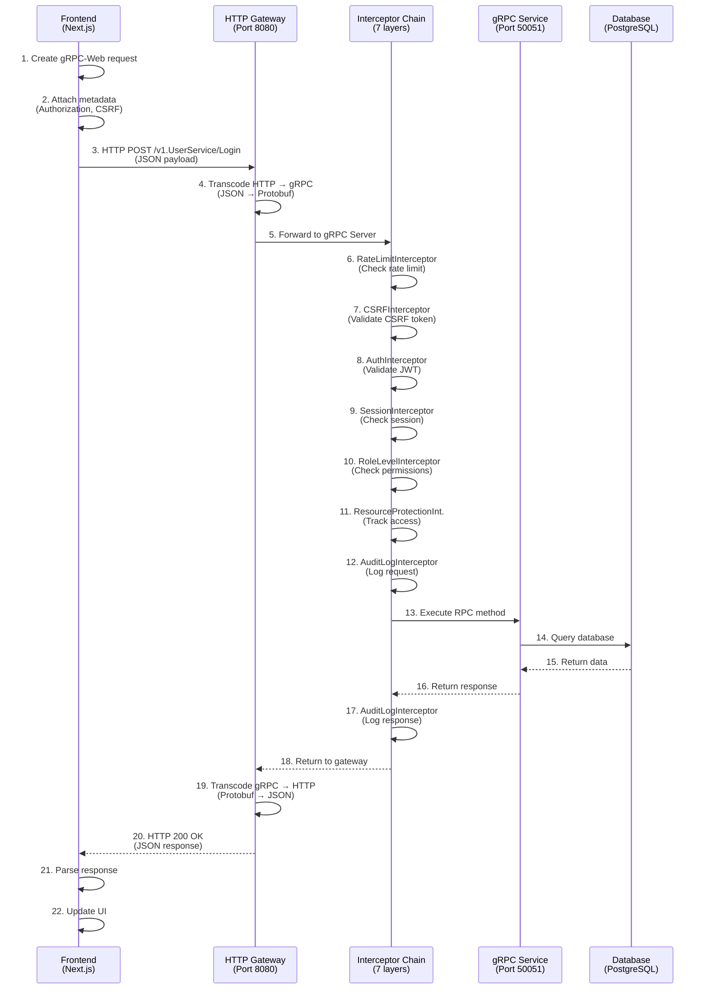

# gRPC Architecture - NyNus Exam Bank System

## 1. System Overview

### 1.1 Dual Protocol Architecture

NyNus sử dụng **dual protocol system** để tối ưu hóa communication giữa các components:

```
┌──────────────────────────────────────────────────────────────────────┐
│                        Browser (Frontend)                             │
│  ┌────────────────────────────────────────────────────────────────┐  │
│  │  Next.js 14 Application (React 18 + TypeScript 5.5)            │  │
│  │                                                                  │  │
│  │  ┌──────────────┐  ┌──────────────┐  ┌──────────────┐         │  │
│  │  │ Auth Service │  │Question Svc  │  │  Exam Svc    │  ...    │  │
│  │  └──────┬───────┘  └──────┬───────┘  └──────┬───────┘         │  │
│  │         │                  │                  │                  │  │
│  │         └──────────────────┴──────────────────┘                 │  │
│  │                            │                                     │  │
│  │                     gRPC-Web Client                             │  │
│  │                  (grpc-web library)                             │  │
│  └────────────────────────────┬───────────────────────────────────┘  │
└─────────────────────────────────┬────────────────────────────────────┘
                                  │
                    HTTP/1.1 + JSON (Port 8080)
                    + Metadata (Authorization, CSRF)
                                  │
                                  ▼
┌──────────────────────────────────────────────────────────────────────┐
│                    Backend Server (Go 1.23.5)                         │
│                                                                        │
│  ┌────────────────────────────────────────────────────────────────┐  │
│  │                    HTTP Gateway (Port 8080)                     │  │
│  │                                                                  │  │
│  │  ┌──────────────────────────────────────────────────────────┐  │  │
│  │  │  grpc-gateway (gRPC-Web → gRPC Transcoding)              │  │  │
│  │  │  - HTTP/1.1 → HTTP/2 conversion                          │  │  │
│  │  │  - JSON ↔ Protocol Buffers serialization                 │  │  │
│  │  │  - CORS handling for browser requests                    │  │  │
│  │  │  - Header mapping (Authorization, CSRF)                  │  │  │
│  │  └──────────────────────────────────────────────────────────┘  │  │
│  └────────────────────────────┬───────────────────────────────────┘  │
│                                │                                      │
│                    HTTP/2 + Protobuf (Internal)                      │
│                                │                                      │
│                                ▼                                      │
│  ┌────────────────────────────────────────────────────────────────┐  │
│  │                    gRPC Server (Port 50051)                     │  │
│  │                                                                  │  │
│  │  ┌──────────────────────────────────────────────────────────┐  │  │
│  │  │  7-Layer Interceptor Chain (Security & Observability)    │  │  │
│  │  │                                                            │  │  │
│  │  │  1. RateLimitInterceptor     - Prevent abuse             │  │  │
│  │  │  2. CSRFInterceptor           - CSRF protection           │  │  │
│  │  │  3. AuthInterceptor           - JWT validation            │  │  │
│  │  │  4. SessionInterceptor        - Session management        │  │  │
│  │  │  5. RoleLevelInterceptor      - Authorization             │  │  │
│  │  │  6. ResourceProtectionInt.    - Resource tracking         │  │  │
│  │  │  7. AuditLogInterceptor       - Audit logging             │  │  │
│  │  └──────────────────────────────────────────────────────────┘  │  │
│  │                                                                  │  │
│  │  ┌──────────────┐  ┌──────────────┐  ┌──────────────┐         │  │
│  │  │ UserService  │  │QuestionSvc   │  │  ExamSvc     │  ...    │  │
│  │  │              │  │              │  │              │          │  │
│  │  │ - Login      │  │ - Create     │  │ - Create     │          │  │
│  │  │ - Register   │  │ - Update     │  │ - Submit     │          │  │
│  │  │ - OAuth      │  │ - Delete     │  │ - Grade      │          │  │
│  │  └──────────────┘  └──────────────┘  └──────────────┘         │  │
│  └────────────────────────────┬───────────────────────────────────┘  │
│                                │                                      │
│                                ▼                                      │
│  ┌────────────────────────────────────────────────────────────────┐  │
│  │                    Data Layer                                   │  │
│  │                                                                  │  │
│  │  ┌──────────────┐  ┌──────────────┐  ┌──────────────┐         │  │
│  │  │ PostgreSQL   │  │  OpenSearch  │  │    Redis     │          │  │
│  │  │   (Prisma)   │  │ (Full-text)  │  │   (Cache)    │          │  │
│  │  └──────────────┘  └──────────────┘  └──────────────┘         │  │
│  └────────────────────────────────────────────────────────────────┘  │
└──────────────────────────────────────────────────────────────────────┘
```

### 1.2 Why Dual Protocol?

**gRPC-Web (Frontend ↔ Backend)**:
- ✅ Browser compatibility (HTTP/1.1)
- ✅ JSON support for debugging
- ✅ CORS handling built-in
- ✅ Works with existing HTTP infrastructure

**Pure gRPC (Backend Internal)**:
- ✅ High performance (HTTP/2 + binary)
- ✅ Bi-directional streaming
- ✅ Multiplexing
- ✅ Lower latency

### 1.3 Request Flow Sequence



## 2. Protocol Buffers

### 2.1 Proto File Organization

```
packages/proto/
├── buf.gen.yaml              # Go code generation config
├── buf.gen.ts.yaml           # TypeScript code generation config
├── buf.yaml                  # Buf configuration
├── common/
│   └── common.proto          # Shared types (UserRole, Response, etc.)
└── v1/
    ├── user.proto            # UserService
    ├── question.proto        # QuestionService
    ├── question_filter.proto # QuestionFilterService
    ├── exam.proto            # ExamService
    ├── admin.proto           # AdminService
    ├── profile.proto         # ProfileService
    ├── contact.proto         # ContactService
    ├── newsletter.proto      # NewsletterService
    ├── notification.proto    # NotificationService
    ├── mapcode.proto         # MapCodeService
    ├── blog.proto            # BlogService (proto only)
    ├── search.proto          # SearchService (proto only)
    ├── import.proto          # ImportService (proto only)
    └── tikz.proto            # TikzCompilerService (proto only)
```

### 2.2 Naming Conventions

**Services**: PascalCase
```protobuf
service UserService { ... }
service QuestionService { ... }
```

**Messages**: PascalCase
```protobuf
message LoginRequest { ... }
message User { ... }
```

**Fields**: snake_case
```protobuf
message User {
  string user_id = 1;
  string first_name = 2;
  bool is_active = 3;
}
```

**Enums**: SCREAMING_SNAKE_CASE
```protobuf
enum UserRole {
  USER_ROLE_UNSPECIFIED = 0;
  USER_ROLE_GUEST = 1;
  USER_ROLE_STUDENT = 2;
}
```

### 2.3 Code Generation

**Go Code Generation** (`buf.gen.yaml`):
```yaml
version: v1
plugins:
  - plugin: buf.build/protocolbuffers/go
    out: ../../apps/backend/pkg/proto
    opt: 
      - paths=source_relative
  - plugin: buf.build/grpc/go
    out: ../../apps/backend/pkg/proto
    opt:
      - paths=source_relative
      - require_unimplemented_servers=false
  - plugin: buf.build/grpc-ecosystem/gateway
    out: ../../apps/backend/pkg/proto
    opt:
      - paths=source_relative
      - generate_unbound_methods=true
```

**TypeScript Code Generation** (`buf.gen.ts.yaml`):
```yaml
version: v1
plugins:
  - plugin: buf.build/protocolbuffers/js
    out: ../../apps/frontend/src/generated
    opt:
      - import_style=commonjs
  - plugin: buf.build/grpc/web
    out: ../../apps/frontend/src/generated
    opt:
      - import_style=typescript
      - mode=grpcwebtext
```

**Generated Code Locations**:
- **Go**: `apps/backend/pkg/proto/v1/*.pb.go`
- **TypeScript**: `apps/frontend/src/generated/v1/*_pb.ts`

**Generation Commands**:
```bash
# Go code
cd packages/proto
buf generate --template buf.gen.yaml

# TypeScript code
buf generate --template buf.gen.ts.yaml
```

## 3. HTTP Gateway

### 3.1 Configuration

**File**: `apps/backend/internal/server/http.go`

**Port**: 8080

**CORS Settings**:
```go
grpcWebWrapper := grpcweb.WrapServer(s.grpcServer,
    grpcweb.WithOriginFunc(func(origin string) bool {
        allowedOrigins := []string{
            "http://localhost:3000",      // Next.js dev
            "http://localhost:3001",      // Alternative port
            "https://nynus.edu.vn",       // Production
        }
        for _, allowed := range allowedOrigins {
            if origin == allowed {
                return true
            }
        }
        return false
    }),
    grpcweb.WithAllowedRequestHeaders([]string{
        "Authorization",
        "Content-Type",
        "X-CSRF-Token",
        "X-Requested-With",
    }),
)
```

**Header Mapping**:
```go
mux := runtime.NewServeMux(
    runtime.WithIncomingHeaderMatcher(func(key string) (string, bool) {
        switch strings.ToLower(key) {
        case "authorization":
            return key, true
        case "x-csrf-token":
            return key, true
        default:
            return runtime.DefaultHeaderMatcher(key)
        }
    }),
)
```

### 3.2 Service Registration

**Registered Services** (HTTP Gateway accessible):
```go
// UserService
v1.RegisterUserServiceHandlerFromEndpoint(ctx, s.mux, endpoint, opts)

// QuestionService
v1.RegisterQuestionServiceHandlerFromEndpoint(ctx, s.mux, endpoint, opts)

// QuestionFilterService
v1.RegisterQuestionFilterServiceHandlerFromEndpoint(ctx, s.mux, endpoint, opts)

// AdminService
v1.RegisterAdminServiceHandlerFromEndpoint(ctx, s.mux, endpoint, opts)

// ProfileService
v1.RegisterProfileServiceHandlerFromEndpoint(ctx, s.mux, endpoint, opts)

// ContactService
v1.RegisterContactServiceHandlerFromEndpoint(ctx, s.mux, endpoint, opts)

// NewsletterService
v1.RegisterNewsletterServiceHandlerFromEndpoint(ctx, s.mux, endpoint, opts)
```

**Commented Out Services** (NOT accessible via HTTP):
```go
// ExamService (Line 247-250)
// if err := v1.RegisterExamServiceHandlerFromEndpoint(ctx, s.mux, endpoint, opts); err != nil {
//     return fmt.Errorf("failed to register ExamService: %w", err)
// }

// MapCodeService (Line 242-245)
// if err := v1.RegisterMapCodeServiceHandlerFromEndpoint(ctx, s.mux, endpoint, opts); err != nil {
//     return fmt.Errorf("failed to register MapCodeService: %w", err)
// }
```

**Missing Registrations**:
- NotificationService
- BlogService, SearchService, ImportService, TikzCompilerService (no backend implementation)

### 3.3 Request/Response Mapping

**gRPC Status Codes → HTTP Status Codes**:
```
gRPC Code              HTTP Status
---------              -----------
OK (0)                 → 200 OK
INVALID_ARGUMENT (3)   → 400 Bad Request
UNAUTHENTICATED (16)   → 401 Unauthorized
PERMISSION_DENIED (7)  → 403 Forbidden
NOT_FOUND (5)          → 404 Not Found
ALREADY_EXISTS (6)     → 409 Conflict
RESOURCE_EXHAUSTED (8) → 429 Too Many Requests
INTERNAL (13)          → 500 Internal Server Error
UNAVAILABLE (14)       → 503 Service Unavailable
```

**Metadata → HTTP Headers**:
```
gRPC Metadata          HTTP Header
-------------          -----------
authorization          → Authorization
x-csrf-token           → X-CSRF-Token
content-type           → Content-Type
```

**Error Response Format**:
```json
{
  "code": 3,
  "message": "invalid email format",
  "details": []
}
```

## 4. Interceptor Chain

### 4.1 Order of Execution

Interceptors execute in **FIFO order** (First In, First Out):

```
Request Flow:
  1. RateLimitInterceptor
  2. CSRFInterceptor
  3. AuthInterceptor
  4. SessionInterceptor
  5. RoleLevelInterceptor
  6. ResourceProtectionInterceptor
  7. AuditLogInterceptor
  → Service Handler

Response Flow:
  Service Handler →
  7. AuditLogInterceptor
  6. ResourceProtectionInterceptor
  5. RoleLevelInterceptor
  4. SessionInterceptor
  3. AuthInterceptor
  2. CSRFInterceptor
  1. RateLimitInterceptor
```

### 4.2 Interceptor Details

#### **1. RateLimitInterceptor**

**Purpose**: Prevent abuse and DDoS attacks

**Implementation**: `apps/backend/internal/middleware/rate_limit_interceptor.go`

**Configuration**:
```go
"/v1.UserService/Login": {
    RequestsPerSecond: 0.1,   // 1 request per 10 seconds
    Burst:             3,      // Allow burst of 3 requests
    PerUser:           false,  // Limit by IP address
},
"/v1.UserService/Register": {
    RequestsPerSecond: 0.017,  // 1 request per minute
    Burst:             1,
    PerUser:           false,
},
```

**Default Rate Limit**: 5 req/s, burst 20 (for unlisted endpoints)

**Error Response**: `RESOURCE_EXHAUSTED` (HTTP 429)

---

#### **2. CSRFInterceptor**

**Purpose**: Protect against Cross-Site Request Forgery attacks

**Implementation**: `apps/backend/internal/middleware/csrf_interceptor.go`

**Public Endpoints** (skip CSRF validation):
```go
"/v1.UserService/Login"
"/v1.UserService/Register"
"/v1.UserService/GoogleLogin"
"/v1.UserService/RefreshToken"
"/v1.UserService/ForgotPassword"
"/v1.UserService/ResetPassword"
"/v1.UserService/VerifyEmail"
```

**Validation**:
- Extract CSRF token from metadata `x-csrf-token`
- Compare with NextAuth CSRF token using constant-time comparison
- Reject if mismatch

**Error Response**: `PERMISSION_DENIED` (HTTP 403)

---

#### **3. AuthInterceptor**

**Purpose**: Validate JWT access tokens

**Implementation**: `apps/backend/internal/middleware/auth_interceptor.go`

**Token Validation**:
1. Extract token from `Authorization: Bearer <token>` metadata
2. Verify JWT signature using secret key
3. Check token expiration (15 minutes)
4. Extract user ID and role from claims
5. Inject user info into context

**Public Endpoints** (skip auth):
- Same as CSRF public endpoints

**Error Response**: `UNAUTHENTICATED` (HTTP 401)

---

#### **4. SessionInterceptor**

**Purpose**: Manage stateful sessions and concurrent session limits

**Implementation**: `apps/backend/internal/middleware/session_interceptor.go`

**Session Management**:
- Validate session token from metadata
- Check session expiration
- Enforce concurrent session limits (e.g., max 3 active sessions per user)
- Track session activity

**Error Response**: `UNAUTHENTICATED` (HTTP 401)

---

#### **5. RoleLevelInterceptor**

**Purpose**: Enforce role-based and level-based authorization

**Implementation**: `apps/backend/internal/middleware/role_level_interceptor.go`

**Role Hierarchy**:
```
ADMIN (5) > TEACHER (4) > TUTOR (3) > STUDENT (2) > GUEST (1)
```

**Level System** (1-9 for STUDENT/TUTOR/TEACHER):
- Horizontal access control within same role
- Example: TEACHER level 5 can access TEACHER level 1-5 resources

**Permission Configuration**:
```go
"/v1.AdminService/ListUsers": {
    AllowedRoles: []common.UserRole{common.UserRole_USER_ROLE_ADMIN},
},
"/v1.ExamService/CreateExam": {
    AllowedRoles: []common.UserRole{
        common.UserRole_USER_ROLE_ADMIN,
        common.UserRole_USER_ROLE_TEACHER,
    },
    MinLevel: 2, // Teacher must have level >= 2
},
```

**Error Response**: `PERMISSION_DENIED` (HTTP 403)

---

#### **6. ResourceProtectionInterceptor**

**Purpose**: Track and validate resource access patterns

**Implementation**: `apps/backend/internal/middleware/resource_protection_interceptor.go`

**Features**:
- Track resource access by user
- Detect suspicious access patterns
- Enforce resource-level permissions
- Log resource access for audit

**Error Response**: `PERMISSION_DENIED` (HTTP 403)

---

#### **7. AuditLogInterceptor**

**Purpose**: Log all operations for compliance and debugging

**Implementation**: `apps/backend/internal/middleware/audit_log_interceptor.go`

**Logged Information**:
- User ID and role
- RPC method called
- Request timestamp
- Response status
- IP address
- User agent

**Storage**: PostgreSQL audit_logs table

---

## 5. Frontend Integration

### 5.1 gRPC-Web Client

**Client Initialization**:
```typescript
// apps/frontend/src/services/grpc/client.ts
import { UserServiceClient } from '@/generated/v1/UserServiceClientPb';

const GRPC_ENDPOINT = process.env.NEXT_PUBLIC_GRPC_URL || 'http://localhost:8080';
const userServiceClient = new UserServiceClient(GRPC_ENDPOINT);
```

**Metadata Attachment**:
```typescript
function getAuthMetadata(): grpcWeb.Metadata {
  const md: grpcWeb.Metadata = {};

  // Add Authorization token
  const token = localStorage.getItem('nynus-auth-token');
  if (token) {
    md['Authorization'] = `Bearer ${token}`;
  }

  // Add CSRF token
  const csrfToken = AuthHelpers.getCSRFToken();
  if (csrfToken) {
    md['x-csrf-token'] = csrfToken;
  }

  return md;
}
```

**Making Requests**:
```typescript
const request = new LoginRequest();
request.setEmail('user@example.com');
request.setPassword('password123');

try {
  const response = await userServiceClient.login(request, getAuthMetadata());
  console.log('Login successful:', response.toObject());
} catch (error) {
  console.error('Login failed:', error);
}
```

### 5.2 Service Wrappers

**Pattern**:
```typescript
// apps/frontend/src/services/grpc/auth.service.ts
export class AuthService {
  static async login(email: string, password: string): Promise<LoginResponse> {
    const request = new LoginRequest();
    request.setEmail(email);
    request.setPassword(password);

    try {
      const response = await userServiceClient.login(request, getAuthMetadata());

      // Store tokens
      const accessToken = response.getAccessToken();
      const refreshToken = response.getRefreshToken();
      localStorage.setItem('nynus-auth-token', accessToken);
      localStorage.setItem('nynus-refresh-token', refreshToken);

      return response;
    } catch (error) {
      throw handleGrpcError(error as RpcError);
    }
  }
}
```

**Error Handling**:
```typescript
function handleGrpcError(error: RpcError): Error {
  switch (error.code) {
    case 3: // INVALID_ARGUMENT
      return new Error(error.message || 'Dữ liệu không hợp lệ');
    case 7: // PERMISSION_DENIED
      return new Error('Bạn không có quyền thực hiện thao tác này');
    case 16: // UNAUTHENTICATED
      return new Error('Bạn cần đăng nhập để tiếp tục');
    default:
      return new Error(error.message || 'Đã xảy ra lỗi');
  }
}
```

---

## 6. Performance Considerations

### 6.1 Connection Pooling

- gRPC reuses HTTP/2 connections
- Connection pool size: Configurable (default: 100)
- Keep-alive: 30 seconds

### 6.2 Streaming RPCs

**Server Streaming** (SearchService):
```protobuf
rpc Search(SearchRequest) returns (stream SearchHit);
```

**Client Streaming** (ImportService):
```protobuf
rpc UploadImportFile(stream FileChunk) returns (UploadResponse);
```

**Bi-directional Streaming** (NotificationService):
```protobuf
rpc SubscribeToNotifications(stream NotificationRequest) returns (stream Notification);
```

### 6.3 Compression

- Protocol Buffers: Binary serialization (smaller than JSON)
- gzip compression: Enabled for large payloads
- Typical size reduction: 60-80% vs JSON

---

## 7. Monitoring & Observability

### 7.1 Logging

**Structured Logging**:
```go
log.Printf("[%s] %s - User: %s, Status: %s, Duration: %dms",
    info.FullMethod,
    time.Now().Format(time.RFC3339),
    userID,
    status.Code(err),
    duration.Milliseconds(),
)
```

### 7.2 Metrics

**Tracked Metrics**:
- Request count per endpoint
- Response time (p50, p95, p99)
- Error rate
- Active connections

### 7.3 Tracing

**Distributed Tracing**:
- Request ID propagation
- Span creation for each interceptor
- Integration with OpenTelemetry (planned)

---

**Last Updated**: 2025-01-19
**Version**: 1.0.0

