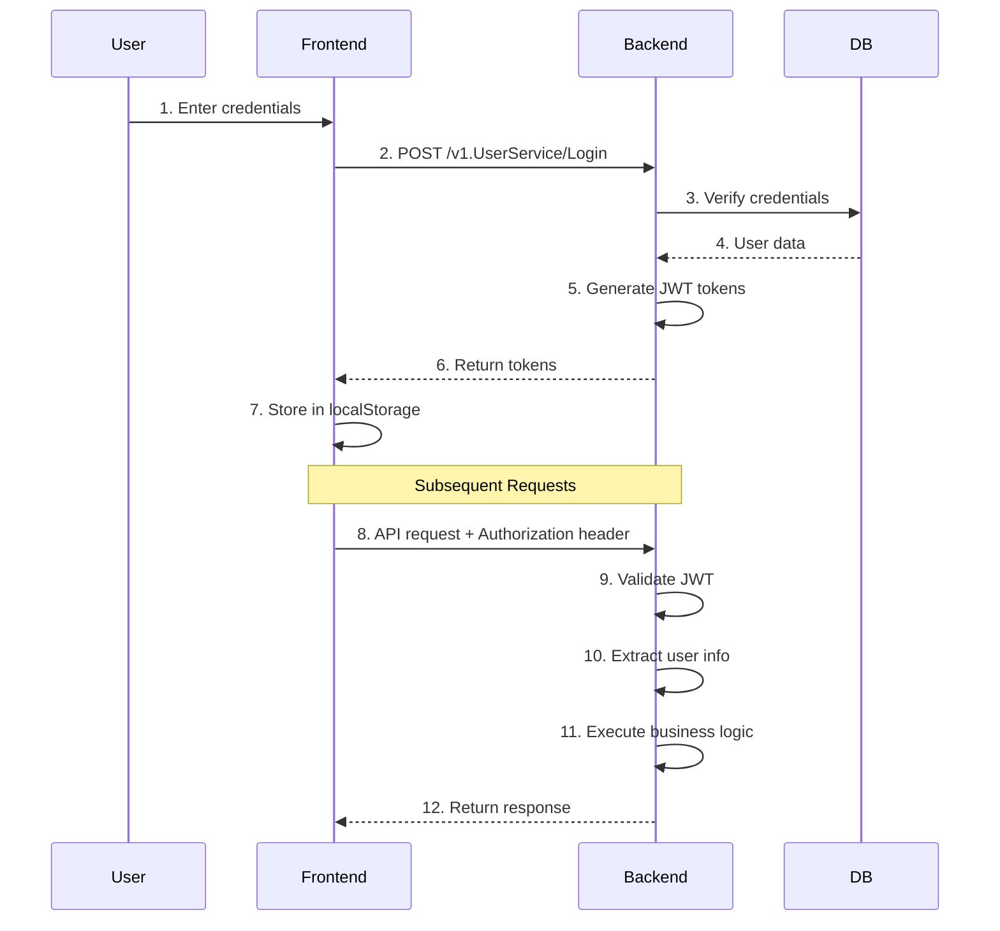

# Security Documentation - gRPC Implementation

## 1. Security Overview

NyNus Exam Bank System implements **defense-in-depth security** với 7-layer interceptor chain và multiple security mechanisms.

### Security Layers

```
┌─────────────────────────────────────────────────────────────┐
│  Layer 7: Audit Logging        - Compliance & Forensics     │
├─────────────────────────────────────────────────────────────┤
│  Layer 6: Resource Protection  - Resource Access Control    │
├─────────────────────────────────────────────────────────────┤
│  Layer 5: Role/Level Auth      - RBAC + Level-based Access  │
├─────────────────────────────────────────────────────────────┤
│  Layer 4: Session Management   - Stateful Session Tracking  │
├─────────────────────────────────────────────────────────────┤
│  Layer 3: Authentication       - JWT Token Validation       │
├─────────────────────────────────────────────────────────────┤
│  Layer 2: CSRF Protection      - Cross-Site Request Forgery │
├─────────────────────────────────────────────────────────────┤
│  Layer 1: Rate Limiting        - DDoS & Abuse Prevention    │
└─────────────────────────────────────────────────────────────┘
```

## 2. Authentication

### 2.1 JWT Token System

**Token Types**:
1. **Access Token**: Short-lived (15 minutes), used for API requests
2. **Refresh Token**: Long-lived (7 days), used to obtain new access tokens

**Token Structure**:
```json
{
  "header": {
    "alg": "HS256",
    "typ": "JWT"
  },
  "payload": {
    "user_id": "uuid-here",
    "email": "user@example.com",
    "role": "USER_ROLE_STUDENT",
    "level": 3,
    "iat": 1705660800,
    "exp": 1705661700
  },
  "signature": "..."
}
```

### 2.2 Authentication Flow



### 2.3 Token Storage

**Backend** (Secure):
```typescript
// NextAuth stores tokens in httpOnly cookies
// - Prevents XSS attacks
// - Automatic CSRF protection
// - Secure flag in production
```

**Frontend** (gRPC Compatibility):
```typescript
// localStorage for gRPC-Web client
// - Required for gRPC metadata attachment
// - XSS mitigation: Content Security Policy
// - Token rotation on refresh
localStorage.setItem('nynus-auth-token', accessToken);
localStorage.setItem('nynus-refresh-token', refreshToken);
```

### 2.4 Token Refresh Flow

```typescript
// Auto-refresh before expiration
async function refreshAccessToken(): Promise<string> {
  const refreshToken = localStorage.getItem('nynus-refresh-token');
  
  const request = new RefreshTokenRequest();
  request.setRefreshToken(refreshToken);
  
  const response = await userServiceClient.refreshToken(request, {});
  
  const newAccessToken = response.getAccessToken();
  const newRefreshToken = response.getRefreshToken();
  
  localStorage.setItem('nynus-auth-token', newAccessToken);
  localStorage.setItem('nynus-refresh-token', newRefreshToken);
  
  return newAccessToken;
}
```

### 2.5 OAuth 2.0 (Google Login)

**Flow**:
1. User clicks "Login with Google"
2. Redirect to Google OAuth consent screen
3. User authorizes application
4. Google returns authorization code
5. Backend exchanges code for Google tokens
6. Backend creates or updates user account
7. Backend generates NyNus JWT tokens
8. Return tokens to frontend

**Implementation**:
```go
// apps/backend/internal/grpc/user_service_enhanced.go
func (s *EnhancedUserServiceServer) GoogleLogin(ctx context.Context, req *v1.GoogleLoginRequest) (*v1.LoginResponse, error) {
    // 1. Verify Google ID token
    googleUser, err := s.oauthService.VerifyGoogleToken(req.IdToken)
    if err != nil {
        return nil, status.Errorf(codes.Unauthenticated, "invalid Google token")
    }
    
    // 2. Find or create user
    user, err := s.userRepo.FindByGoogleID(googleUser.ID)
    if err != nil {
        user, err = s.userRepo.CreateFromGoogle(googleUser)
    }
    
    // 3. Generate NyNus tokens
    accessToken, refreshToken, err := s.jwtService.GenerateTokenPair(user)
    
    return &v1.LoginResponse{
        AccessToken:  accessToken,
        RefreshToken: refreshToken,
        User:         user,
    }, nil
}
```

## 3. Authorization

### 3.1 Role-Based Access Control (RBAC)

**Role Hierarchy**:
```
ADMIN (5)
  ↓ Can access all TEACHER, TUTOR, STUDENT, GUEST resources
TEACHER (4)
  ↓ Can access all TUTOR, STUDENT, GUEST resources
TUTOR (3)
  ↓ Can access all STUDENT, GUEST resources
STUDENT (2)
  ↓ Can access all GUEST resources
GUEST (1)
  ↓ Limited access
```

**Permission Configuration**:
```go
// apps/backend/internal/middleware/role_level_interceptor.go
var rolePermissions = map[string]RoleRequirement{
    // Admin-only endpoints
    "/v1.AdminService/ListUsers": {
        AllowedRoles: []common.UserRole{common.UserRole_USER_ROLE_ADMIN},
    },
    "/v1.AdminService/UpdateUserRole": {
        AllowedRoles: []common.UserRole{common.UserRole_USER_ROLE_ADMIN},
    },
    
    // Teacher + Admin endpoints
    "/v1.ExamService/CreateExam": {
        AllowedRoles: []common.UserRole{
            common.UserRole_USER_ROLE_ADMIN,
            common.UserRole_USER_ROLE_TEACHER,
        },
        MinLevel: 2, // Teacher must have level >= 2
    },
    
    // Student + higher endpoints
    "/v1.ExamService/StartExam": {
        AllowedRoles: []common.UserRole{
            common.UserRole_USER_ROLE_ADMIN,
            common.UserRole_USER_ROLE_TEACHER,
            common.UserRole_USER_ROLE_TUTOR,
            common.UserRole_USER_ROLE_STUDENT,
        },
    },
}
```

### 3.2 Level-Based Access Control

**Level System** (1-9 for STUDENT/TUTOR/TEACHER):

**Horizontal Access Control**:
- TEACHER level 5 can access resources created by TEACHER level 1-5
- STUDENT level 3 can access resources for STUDENT level 1-3

**Vertical Access Control**:
- Combined with role hierarchy
- Example: TEACHER level 2 > TUTOR level 9

**Implementation**:
```go
func (i *RoleLevelInterceptor) checkPermission(userRole common.UserRole, userLevel int32, requirement RoleRequirement) bool {
    // Check role permission
    roleAllowed := false
    for _, allowedRole := range requirement.AllowedRoles {
        if userRole == allowedRole {
            roleAllowed = true
            break
        }
    }
    
    if !roleAllowed {
        return false
    }
    
    // Check level requirement
    if requirement.MinLevel > 0 && userLevel < requirement.MinLevel {
        return false
    }
    
    return true
}
```

### 3.3 Resource-Level Permissions

**Resource Ownership**:
```go
// Check if user owns the resource
func (s *QuestionService) UpdateQuestion(ctx context.Context, req *v1.UpdateQuestionRequest) (*v1.UpdateQuestionResponse, error) {
    userID := GetUserIDFromContext(ctx)
    
    question, err := s.questionRepo.FindByID(req.QuestionId)
    if err != nil {
        return nil, status.Errorf(codes.NotFound, "question not found")
    }
    
    // Only owner or admin can update
    if question.CreatedBy != userID && !IsAdmin(ctx) {
        return nil, status.Errorf(codes.PermissionDenied, "not authorized to update this question")
    }
    
    // Proceed with update
    // ...
}
```

## 4. CSRF Protection

### 4.1 CSRF Token Validation

**Token Source**: NextAuth CSRF token from cookies

**Validation Process**:
1. Extract CSRF token from `x-csrf-token` metadata
2. Extract NextAuth CSRF token from cookies
3. Compare using constant-time comparison (prevent timing attacks)
4. Reject if mismatch

**Implementation**:
```go
// apps/backend/internal/middleware/csrf_interceptor.go
func (i *CSRFInterceptor) Unary() grpc.UnaryServerInterceptor {
    return func(ctx context.Context, req interface{}, info *grpc.UnaryServerInfo, handler grpc.UnaryHandler) (interface{}, error) {
        // Skip public endpoints
        if i.publicEndpoints[info.FullMethod] {
            return handler(ctx, req)
        }
        
        // Extract CSRF token from metadata
        md, ok := metadata.FromIncomingContext(ctx)
        if !ok {
            return nil, status.Errorf(codes.PermissionDenied, "missing metadata")
        }
        
        csrfTokens := md["x-csrf-token"]
        if len(csrfTokens) == 0 {
            return nil, status.Errorf(codes.PermissionDenied, "missing CSRF token")
        }
        
        // Validate CSRF token (constant-time comparison)
        if !i.validateCSRFToken(csrfTokens[0]) {
            return nil, status.Errorf(codes.PermissionDenied, "invalid CSRF token")
        }
        
        return handler(ctx, req)
    }
}

func (i *CSRFInterceptor) validateCSRFToken(token string) bool {
    expectedToken := i.getExpectedCSRFToken()
    return subtle.ConstantTimeCompare([]byte(token), []byte(expectedToken)) == 1
}
```

### 4.2 Public Endpoints

**Endpoints that skip CSRF validation**:
```go
var publicEndpoints = map[string]bool{
    "/v1.UserService/Login":          true,
    "/v1.UserService/Register":       true,
    "/v1.UserService/GoogleLogin":    true,
    "/v1.UserService/RefreshToken":   true,
    "/v1.UserService/ForgotPassword": true,
    "/v1.UserService/ResetPassword":  true,  // ⚠️ POTENTIAL VULNERABILITY
    "/v1.UserService/VerifyEmail":    true,
}
```

**⚠️ Security Concern**: `ResetPassword` is public - should validate reset token instead

## 5. Rate Limiting

### 5.1 Rate Limit Configuration

**Endpoint-Specific Limits**:
```go
// apps/backend/internal/middleware/rate_limit_interceptor.go
var rateLimits = map[string]RateLimit{
    "/v1.UserService/Login": {
        RequestsPerSecond: 0.1,   // 1 request per 10 seconds
        Burst:             3,      // Allow burst of 3 requests
        PerUser:           false,  // Limit by IP address
    },
    "/v1.UserService/Register": {
        RequestsPerSecond: 0.017,  // 1 request per minute
        Burst:             1,
        PerUser:           false,
    },
    "/v1.UserService/ForgotPassword": {
        RequestsPerSecond: 0.017,  // 1 request per minute
        Burst:             1,
        PerUser:           false,
    },
}
```

**Default Rate Limit**: 5 req/s, burst 20 (for unlisted endpoints)

### 5.2 Rate Limiting Strategies

**By IP Address** (`PerUser: false`):
- Used for public endpoints (Login, Register)
- Prevents brute-force attacks from single IP
- Uses client IP from metadata

**By User ID** (`PerUser: true`):
- Used for authenticated endpoints
- Prevents abuse by authenticated users
- Uses user ID from JWT claims

### 5.3 Implementation

```go
func (i *RateLimitInterceptor) Unary() grpc.UnaryServerInterceptor {
    return func(ctx context.Context, req interface{}, info *grpc.UnaryServerInfo, handler grpc.UnaryHandler) (interface{}, error) {
        // Get rate limit config for endpoint
        limit, exists := i.rateLimits[info.FullMethod]
        if !exists {
            limit = i.defaultLimit
        }
        
        // Get limiter key (IP or User ID)
        key := i.getLimiterKey(ctx, limit.PerUser)
        
        // Get or create limiter
        limiter := i.getLimiter(key, limit)
        
        // Check if request is allowed
        if !limiter.Allow() {
            return nil, status.Errorf(codes.ResourceExhausted, "rate limit exceeded")
        }
        
        return handler(ctx, req)
    }
}
```

---

**Continued in TROUBLESHOOTING.md for security best practices...**

**Last Updated**: 2025-01-19  
**Version**: 1.0.0

